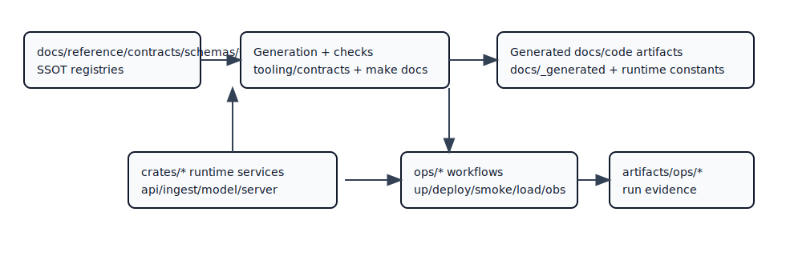

# Architecture Map

- Owner: `architecture`
- Type: `concept`
- Audience: `contributor`
- Stability: `stable`
- Last verified against: `main@ff4b8084`
- Reason to exist: provide one canonical map of Atlas runtime topology.

## Runtime Direction

`server -> query -> store -> immutable artifacts`

## Diagram

## Operational Relevance

This map identifies ownership boundaries for incident response and deployment risk analysis.

## Narrative Rule

Use this page as a visual companion to [Dataflow](dataflow.md), not as a replacement narrative.

## What to Read Next

- [Architecture](index.md)
- [Dataflow](dataflow.md)
- [Runtime Data Model](runtime-data-model.md)

## Document Taxonomy

- Audience: `contributor`
- Type: `concept`
- Stability: `stable`
- Owner: `architecture`
