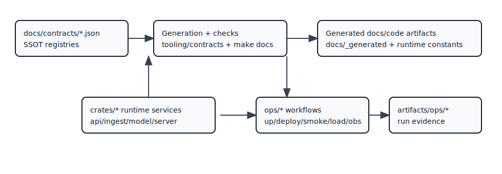

# Architecture Map

Owner: `architecture`  
Type: `concept`  
Reason to exist: provide one canonical map of Atlas runtime topology.

## Runtime Direction

`server -> query -> store -> immutable artifacts`

## Diagram

## Operational Relevance

This map identifies ownership boundaries for incident response and deployment risk analysis.

## Related Pages

- [Architecture](index.md)
- [Components](components.md)
- [Dataflow](dataflow.md)
