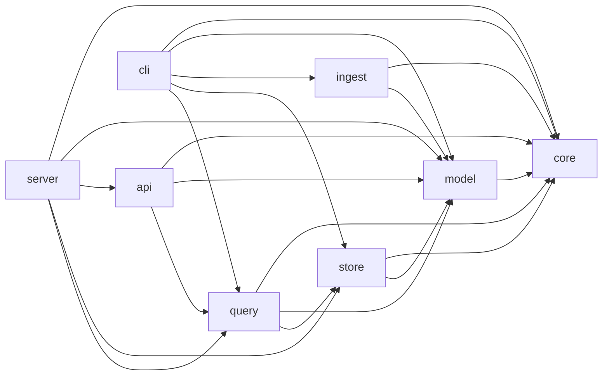

# Bijux Atlas Crate Boundaries

Concept ID: `concept.crate-boundaries`

- Owner: `bijux-atlas-core`

Allowed crate dependency directions:

- `bijux-atlas-core`: no internal dependencies.
- `bijux-atlas-model` -> `bijux-atlas-core`.
- `bijux-atlas-ingest` -> `bijux-atlas-core`, `bijux-atlas-model`.
- `bijux-atlas-store` -> `bijux-atlas-core`, `bijux-atlas-model`.
- `bijux-atlas-query` -> `bijux-atlas-core`, `bijux-atlas-model`, `bijux-atlas-store`, `bijux-atlas-policies`.
- `bijux-atlas-api` -> `bijux-atlas-core`, `bijux-atlas-model`, `bijux-atlas-query`.
- `bijux-atlas-cli` -> `bijux-atlas-core`, `bijux-atlas-model`, `bijux-atlas-ingest`, `bijux-atlas-store`, `bijux-atlas-query`, `bijux-atlas-policies`.
- `bijux-atlas-server` -> `bijux-atlas-core`, `bijux-atlas-model`, `bijux-atlas-api`, `bijux-atlas-store`, `bijux-atlas-query`.

Disallowed by default:

- Any dependency edge not listed above.
- Cycles among internal crates.
- `bijux-atlas-server` importing ingest internals directly.
- Query runtime dependencies (`tokio`, `reqwest`, `axum`, `hyper`) in `bijux-atlas-query`.
