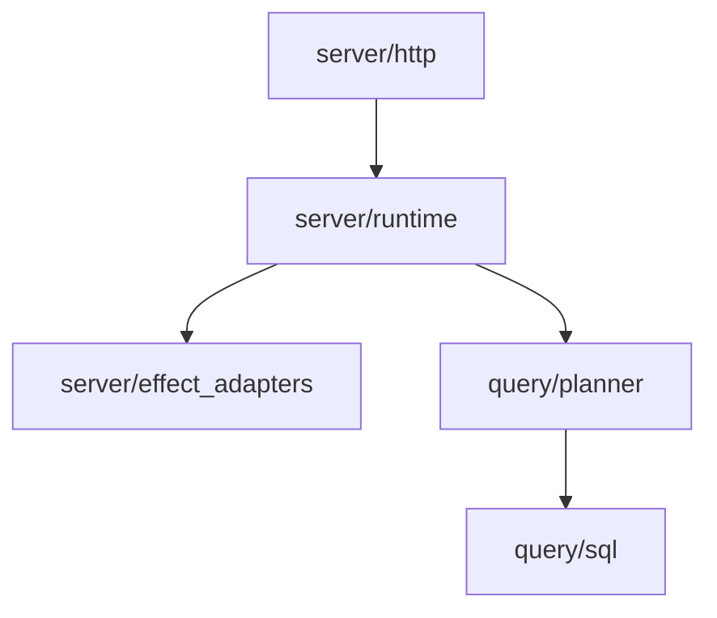

# Effects Boundary Maps

Concept IDs: concept.effects-boundary

- Owner: `bijux-atlas-server`

This document defines directory-level effect boundaries beyond crate-level boundaries.

Canonical page: [`docs/architecture/effects.md`](effects.md)

## bijux-atlas-server
- `src/http/`: request/response mapping only; raw filesystem access is forbidden.
- `src/runtime/server_runtime_core.rs`: long-lived state and orchestration state machines.
- `src/runtime/server_runtime_app.rs`: route wiring and orchestration entrypoints.
- `src/runtime/dataset_cache_manager_*.rs`: effectful runtime operations.
- `src/effect_adapters/*_adapters.rs`: approved effect adapters (`fs`, `sqlite`, `clock`, `random`).

## bijux-atlas-query
- Pure planning modules: `planner.rs`, `filters.rs`, `cost.rs`, `limits.rs`.
- SQL/DB modules: `sql.rs`, `row_decode.rs`, `lib.rs`.
- Pure planner modules must not import `rusqlite`, `reqwest`, `std::fs`, `std::process`, `tokio::net`.

## Enforcement
- `bijux dev atlas check effects-lint`
- `crates/bijux-atlas-query/tests/purity_boundaries.rs`
- `crates/bijux-atlas-server/tests/support_module_guardrails.rs`

