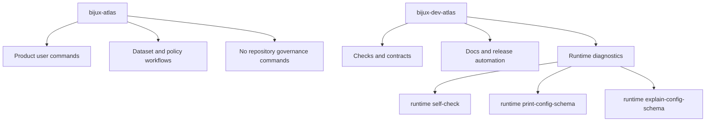

# CLI taxonomy diagram

```mermaid
flowchart TD
  A[bijux-atlas] --> A1[Product user commands]
  A --> A2[Dataset and policy workflows]
  A --> A3[No repository governance commands]

  B[bijux-dev-atlas] --> B1[Checks and contracts]
  B --> B2[Docs and release automation]
  B --> B3[Runtime diagnostics]

  B3 --> C1[runtime self-check]
  B3 --> C2[runtime print-config-schema]
  B3 --> C3[runtime explain-config-schema]
```
