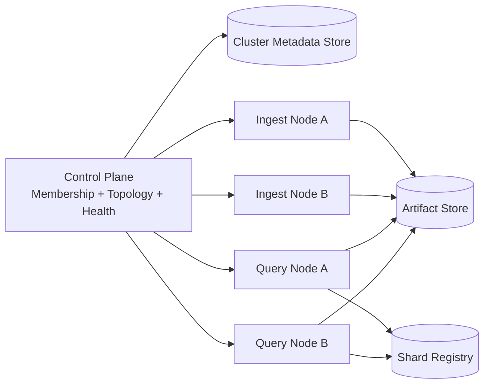

# Cluster Topology

- Owner: `architecture`
- Type: `concept`
- Audience: `contributor`
- Stability: `evolving`
- Reason to exist: define the topology model and deployment variants used by Atlas cluster runtime.

## Topology Summary

Atlas cluster topology is organized around a deterministic control plane plus role-based worker nodes.

1. Control-plane services maintain membership and topology state.
2. Ingest-role nodes materialize dataset artifacts.
3. Query-role nodes serve read paths.
4. Hybrid-role nodes support both workflows in constrained environments.

## Topology Contract

- Cluster contract: `configs/contracts/cluster/cluster-config.schema.json`
- Node contract: `configs/contracts/cluster/node-config.schema.json`
- Runtime examples: `configs/ops/runtime/cluster-config.example.json` and `configs/ops/runtime/node-config.example.json`

## Cluster Architecture Diagram

## Topology Invariants

1. Every node has a stable `node_id` and monotonic `generation`.
2. All ownership decisions come from a single topology version.
3. Role-capability mismatches are rejected at admission.
4. Draining nodes cannot receive new ownership assignments.

## Operational Entry Points

- `/debug/cluster-status` for status introspection.
- `bijux-dev-atlas system cluster topology` for topology view.
- `bijux-dev-atlas system cluster status` for health summary.
