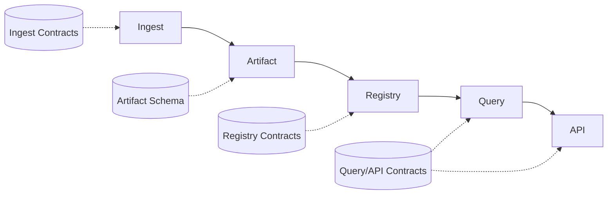

# Contract Runtime Mapping

- Owner: `architecture`
- Type: `concept`
- Audience: `contributor`
- Stability: `stable`
- Last verified against: `main@ff4b8084`
- Reason to exist: map runtime stages to the contracts that constrain them.

## Mapping

## Notes

- Contract checks pin allowed behavior at each runtime stage.
- Runtime changes that break mapping require explicit contract updates.

## What to Read Next

- [Runtime Data Model](runtime-data-model.md)
- [Dataflow](dataflow.md)
- [Reference Contracts](../reference/contracts/index.md)

## Document Taxonomy

- Audience: `contributor`
- Type: `concept`
- Stability: `stable`
- Owner: `architecture`
