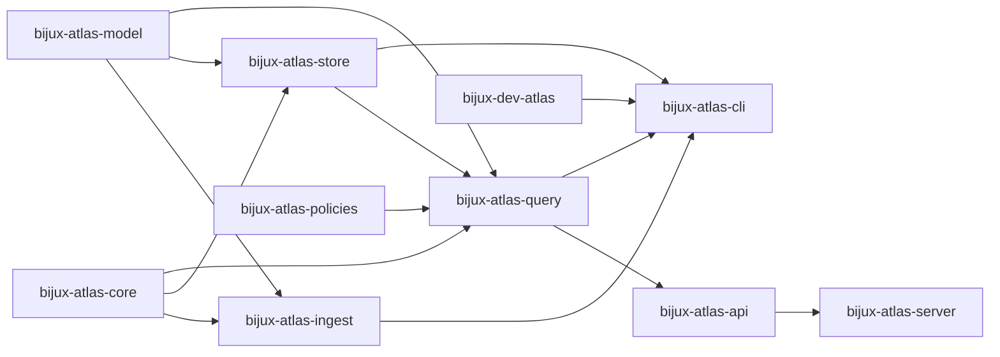

# Crates map

- Owner: `architecture`
- Type: `concept`
- Audience: `contributor`
- Stability: `stable`
- Last verified against: `main@bdd91bc0`
- Reason to exist: provide one-page crate topology with ownership, stability, inputs, and outputs.

## Crate dependency direction rules

## Foundation layer

- `bijux-atlas-core`: core invariants, canonicalization helpers, and shared primitives.
- `bijux-atlas-model`: domain model types shared across runtime and tooling.
- `bijux-atlas-policies`: policy evaluation and policy schema surfaces.

## Runtime data layer

- `bijux-atlas-ingest`: source ingestion, validation, and artifact build path.
- `bijux-atlas-store`: artifact and serving-store access layer.
- `bijux-atlas-query`: deterministic query execution over serving data.

## Runtime interface layer

- `bijux-atlas-api`: HTTP/API behavior contracts and response semantics.
- `bijux-atlas-server`: production server process, readiness, and serving controls.
- `bijux-atlas-cli`: runtime-facing CLI workflows and local operations.

## Control-plane layer

- `bijux-dev-atlas`: contributor and CI control-plane entrypoint.
- `ops/` surfaces: operational orchestration, validation, and reporting lanes.

## Crate contract table

| Crate | Role | Inputs | Outputs | Stability | Owner |
| --- | --- | --- | --- | --- | --- |
| `bijux-atlas-core` | shared invariants and primitives | runtime requests, config values | canonical helpers, shared contracts | stable | architecture |
| `bijux-atlas-model` | domain types | ingest payloads, query parameters | normalized model objects | stable | architecture |
| `bijux-atlas-policies` | policy evaluation | policy documents, runtime context | policy decisions | stable | architecture |
| `bijux-atlas-ingest` | ingest and validation | source datasets, ingest config | validated artifacts | stable | architecture |
| `bijux-atlas-store` | artifact and serving-store access | artifacts, release metadata | serving-store state, store reads | stable | architecture |
| `bijux-atlas-query` | deterministic query execution | serving-store state, query params | query responses | stable | architecture |
| `bijux-atlas-api` | API contract surface | query responses, request params | HTTP responses | stable | architecture |
| `bijux-atlas-server` | runtime process hosting | API handlers, runtime config | running service endpoints | stable | architecture |
| `bijux-atlas-cli` | operator/runtime CLI | command args, runtime services | operational command effects | stable | architecture |
| `bijux-dev-atlas` | control-plane checks and reporting | repo state, contract definitions | reports, gates, generated artifacts | stable | platform |

## What to Read Next

- [Layering rules](layering-rules.md)
- [Boundaries](boundaries.md)
- [Dataflow](dataflow.md)

## Document Taxonomy

- Audience: `contributor`
- Type: `concept`
- Stability: `stable`
- Owner: `architecture`
