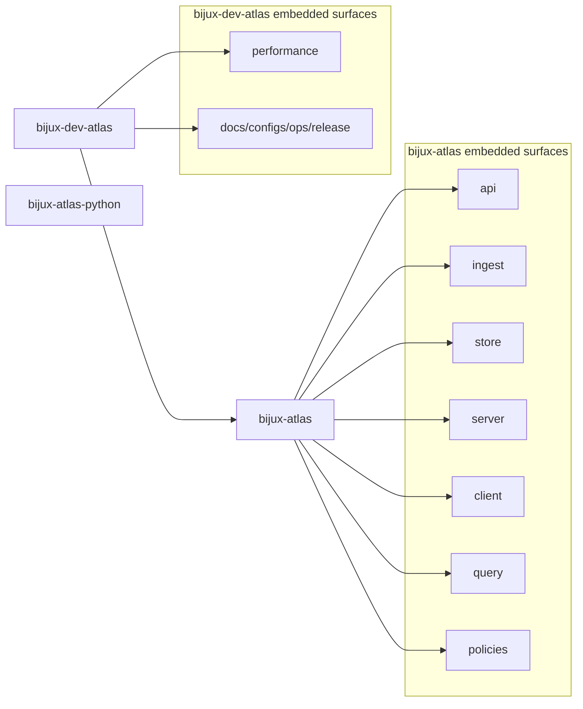

# Crates map

- Owner: `architecture`
- Type: `concept`
- Audience: `contributor`
- Stability: `stable`
- Last verified against: `main@7dea4f4b9a65a61796b0f7ac8c2d185c0eaddb07`
- Reason to exist: provide one-page crate topology with ownership, stability, inputs, and outputs.

## Crate dependency direction rules

```mermaid
flowchart LR
  dev[bijux-dev-atlas] --> cli[bijux-atlas]
  py[bijux-atlas-python]
  subgraph runtime[bijux-atlas embedded surfaces]
    api[api]
    ingest[ingest]
    store[store]
    server[server]
    client[client]
    query[query]
    policies[policies]
  end
  cli --> api
  cli --> ingest
  cli --> store
  cli --> server
  cli --> client
  cli --> query
  cli --> policies
  subgraph control[bijux-dev-atlas embedded surfaces]
    perf[performance]
    docs[docs/configs/ops/release]
  end
  dev --> perf
  dev --> docs
```

## Runtime layer

- `bijux-atlas`: runtime-facing CLI workflows, query execution, policy evaluation, and all embedded runtime modules.
- Embedded `api`, `ingest`, `store`, `server`, `client`, `query`, `model`, and `policies` modules remain part of the single runtime crate.

## Distribution layer

- `bijux-atlas-python`: Python SDK distribution crate with package metadata, compatibility artifacts, and optional `pyo3` bindings.

## Control-plane layer

- `bijux-dev-atlas`: contributor and CI control-plane entrypoint with benchmark and perf evidence support.
- `ops/` surfaces: operational orchestration, validation, and reporting lanes.

## Crate contract table

| Crate | Role | Inputs | Outputs | Stability | Owner |
| --- | --- | --- | --- | --- | --- |
| `bijux-atlas` | runtime package with embedded runtime modules | command args, runtime services, dataset artifacts | runtime effects, query responses, API/server/client binaries | stable | architecture |
| `bijux-atlas-python` | Python SDK distribution and optional native bridge | Python package metadata, compatibility policy, SDK source tree | PyPI artifacts, optional native bindings, compatibility payloads | stable | platform |
| `bijux-dev-atlas` | control-plane checks, reporting, and perf evidence | repo state, contract definitions, perf configs | reports, gates, generated artifacts, benchmark metadata | stable | platform |

## What to Read Next

- [Layering rules](layering-rules.md)
- [Boundaries](boundaries.md)
- [Dataflow](dataflow.md)

## Document Taxonomy

- Audience: `contributor`
- Type: `concept`
- Stability: `stable`
- Owner: `architecture`
