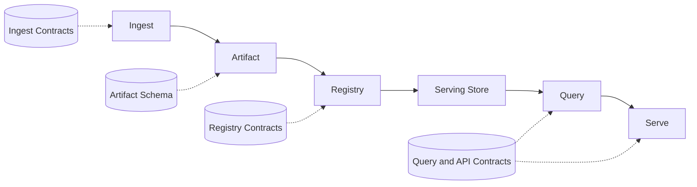

# Dataflow

- Owner: `architecture`
- Type: `concept`
- Audience: `contributor`
- Stability: `stable`
- Last verified against: `main@bdd91bc0`
- Reason to exist: define the canonical end-to-end runtime flow from ingest to serving, including contracts and failure behavior.

## Runtime Flow

`ingest -> artifact -> registry/store -> query -> serve`



## Read Path vs Write Path

- Write path: ingest validates source inputs and publishes immutable artifacts.
- Read path: query and API serve immutable release data with deterministic semantics.

## Query Semantics Invariants

- Pagination and ordering semantics are stable across equivalent requests.
- Filters and sorts are contract-defined and do not mutate result correctness.
- API compatibility policy is enforced independently of runtime cache choices.

See: [API](../api/index.md) and [Reference](../reference/index.md).

## Determinism Guardrails

- Artifact generation canonicalizes and hashes outputs before publication.
- Registry merges are deterministic across equivalent release inputs.
- Query and API contracts pin ordering, filtering, and pagination behavior.

## Failure Modes

- Ingest validation failure blocks publication. See [Dataset corruption runbook](../operations/runbooks/dataset-corruption.md).
- Registry conflict blocks release alias progression. See [Registry federation runbook](../operations/runbooks/registry-federation.md).
- Store or query pressure triggers degraded but explicit behavior. See [Store outage runbook](../operations/runbooks/store-outage.md).
- Client-facing failures are mapped in [Reference errors](../reference/errors.md).

## Operational Relevance

Each stage has independent verification and rollback controls for safer deployments.

## What This Page Is Not

This page is not a runbook and not a schema reference.

## Example

```text
Input file accepted -> artifact published -> release alias updated -> query served.
```

## What to Read Next

- [Architecture](index.md)
- [Boundaries](boundaries.md)
- [Storage](storage.md)
- [Run locally](../operations/run-locally.md)
- [Glossary](../glossary.md)

## Document Taxonomy

- Audience: `contributor`
- Type: `concept`
- Stability: `stable`
- Owner: `architecture`
