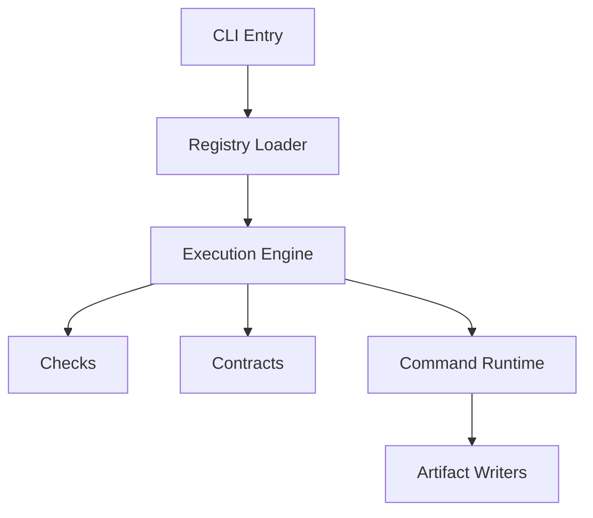

# Control Plane Diagram

```mermaid
flowchart TB
    CLI[CLI Entry] --> REG[Registry Loader]
    REG --> ENG[Execution Engine]
    ENG --> CHK[Checks]
    ENG --> CTR[Contracts]
    ENG --> CMD[Command Runtime]
    CMD --> ART[Artifact Writers]
```
