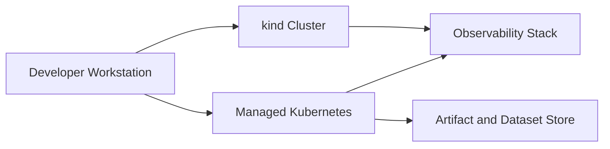

# Deployment Diagram

```mermaid
flowchart LR
    DEV[Developer Workstation] --> KIND[kind Cluster]
    DEV --> K8S[Managed Kubernetes]
    KIND --> OBS[Observability Stack]
    K8S --> OBS
    K8S --> STORE[Artifact and Dataset Store]
```
