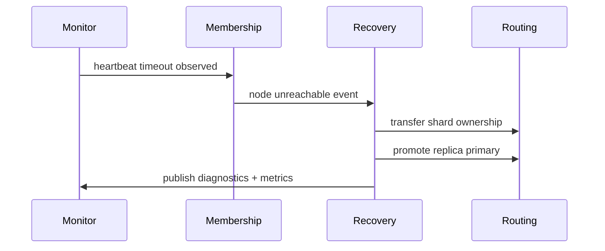

# Failure Flow Diagram

```mermaid
sequenceDiagram
  participant Monitor
  participant Membership
  participant Recovery
  participant Routing

  Monitor->>Membership: heartbeat timeout observed
  Membership->>Recovery: node unreachable event
  Recovery->>Routing: transfer shard ownership
  Recovery->>Routing: promote replica primary
  Recovery->>Monitor: publish diagnostics + metrics
```
