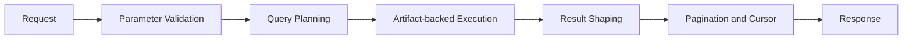

# Query Execution Diagram

```mermaid
flowchart LR
    RQ[Request] --> PV[Parameter Validation]
    PV --> PL[Query Planning]
    PL --> EX[Artifact-backed Execution]
    EX --> RS[Result Shaping]
    RS --> PG[Pagination and Cursor]
    PG --> RP[Response]
```
