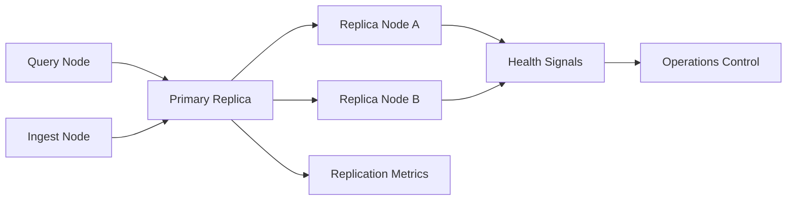

# Replication Architecture Diagram

```mermaid
graph LR
  Q[Query Node] --> P[Primary Replica]
  I[Ingest Node] --> P
  P --> R1[Replica Node A]
  P --> R2[Replica Node B]
  P --> M[Replication Metrics]
  R1 --> H[Health Signals]
  R2 --> H
  H --> O[Operations Control]
```
