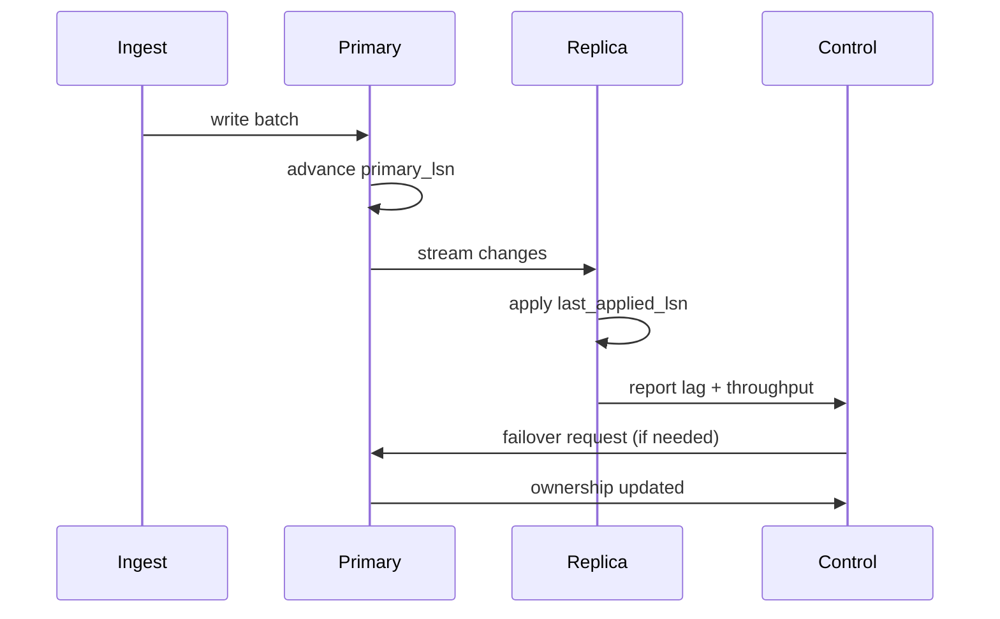

# Replication Flow Diagram

```mermaid
sequenceDiagram
  participant Ingest
  participant Primary
  participant Replica
  participant Control

  Ingest->>Primary: write batch
  Primary->>Primary: advance primary_lsn
  Primary->>Replica: stream changes
  Replica->>Replica: apply last_applied_lsn
  Replica->>Control: report lag + throughput
  Control->>Primary: failover request (if needed)
  Primary->>Control: ownership updated
```
