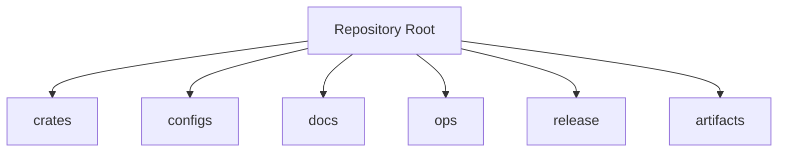

# Repository Structure Diagram

```mermaid
flowchart TB
    ROOT[Repository Root] --> CR[crates]
    ROOT --> CFG[configs]
    ROOT --> DOC[docs]
    ROOT --> OPS[ops]
    ROOT --> REL[release]
    ROOT --> ART[artifacts]
```
