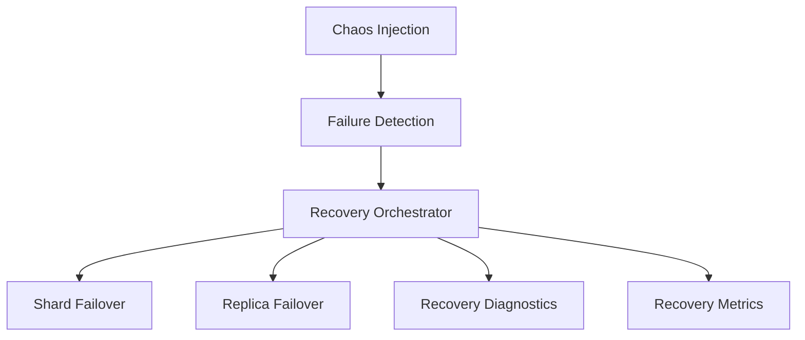

# Resilience Architecture Diagram

```mermaid
graph TD
  F[Failure Detection] --> R[Recovery Orchestrator]
  R --> S[Shard Failover]
  R --> P[Replica Failover]
  R --> D[Recovery Diagnostics]
  R --> M[Recovery Metrics]
  C[Chaos Injection] --> F
```
