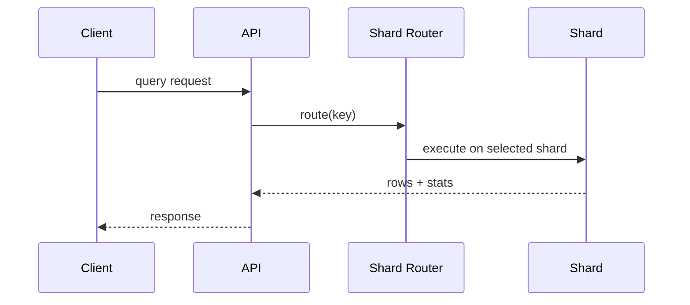

# Shard Query Flow

```mermaid
sequenceDiagram
    participant C as Client
    participant A as API
    participant SR as Shard Router
    participant SH as Shard
    C->>A: query request
    A->>SR: route(key)
    SR->>SH: execute on selected shard
    SH-->>A: rows + stats
    A-->>C: response
```
