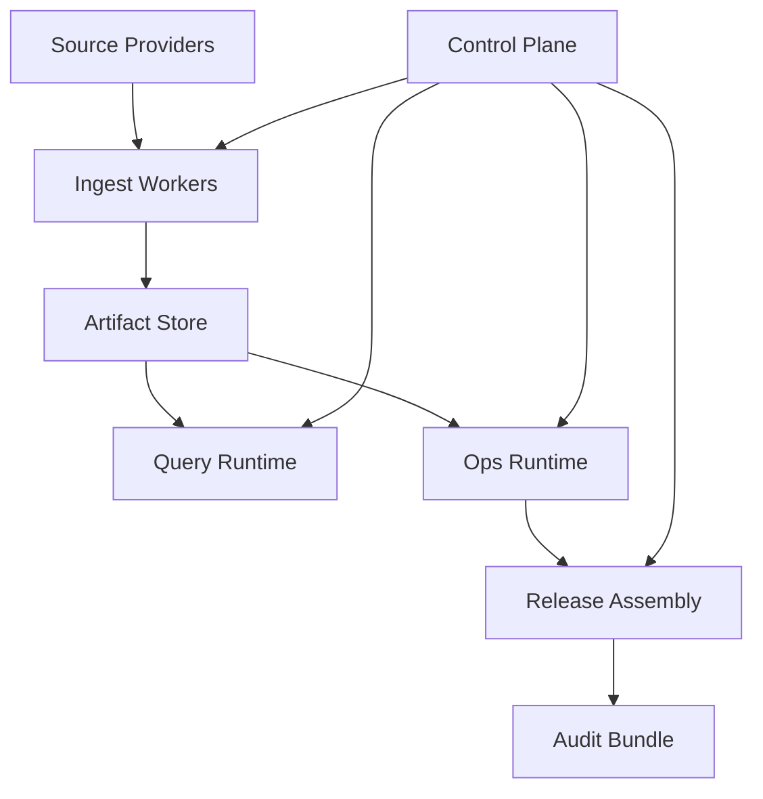

# System Topology Diagram

```mermaid
flowchart TB
    SRC[Source Providers] --> ING[Ingest Workers]
    ING --> ART[Artifact Store]
    ART --> QRY[Query Runtime]
    ART --> OPS[Ops Runtime]
    OPS --> REL[Release Assembly]
    REL --> AUD[Audit Bundle]
    CP[Control Plane] --> ING
    CP --> QRY
    CP --> OPS
    CP --> REL
```
