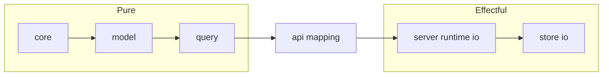

# Effects And Boundaries

Concept ID: `concept.effects-boundary`

- Owner: `bijux-atlas-server`

Effect policy for Phase 1:

- Pure domain and transformation crates: `core`, `model`, `ingest`, `query`.
  - No external process spawning.
  - No direct filesystem/network side effects.
- Store crate (`bijux-atlas-store`): allowed to perform storage I/O.
- Server crate (`bijux-atlas-server`): allowed to perform wiring/bootstrap I/O only.
- API crate (`bijux-atlas-api`): pure read-service layer over query outputs.
  - No raw GFF3/FASTA reading.
  - No process spawning.

Override/escape hatches are forbidden unless explicitly documented and approved in policy docs.
