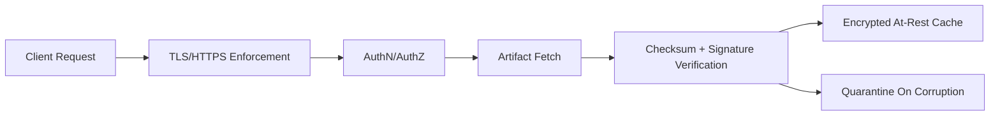

# Encryption Architecture Diagrams

## Data Protection Path

```mermaid
flowchart LR
  Request[Client Request] --> Transport[TLS/HTTPS Enforcement]
  Transport --> Authz[AuthN/AuthZ]
  Authz --> Artifact[Artifact Fetch]
  Artifact --> Integrity[Checksum + Signature Verification]
  Integrity --> Cache[Encrypted At-Rest Cache]
  Integrity --> Quarantine[Quarantine On Corruption]
```
