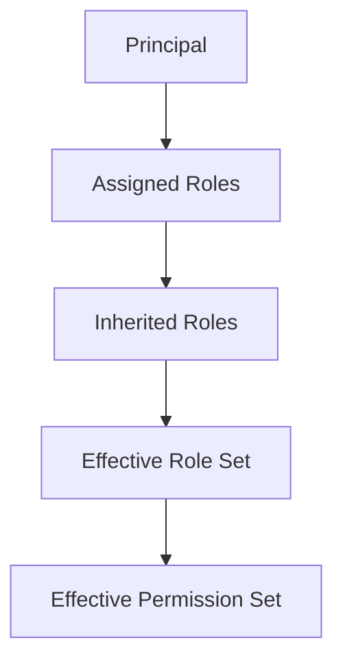
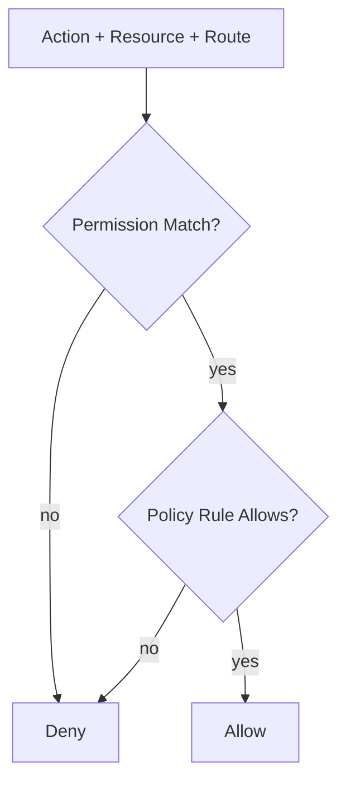

# RBAC Flow Diagrams

## Role Resolution

```mermaid
flowchart TD
  Principal[Principal] --> Assigned[Assigned Roles]
  Assigned --> Inherited[Inherited Roles]
  Inherited --> Effective[Effective Role Set]
  Effective --> Permissions[Effective Permission Set]
```

## Decision Flow

```mermaid
flowchart TD
  Start[Action + Resource + Route] --> PermissionCheck{Permission Match?}
  PermissionCheck -- no --> Deny[Deny]
  PermissionCheck -- yes --> PolicyCheck{Policy Rule Allows?}
  PolicyCheck -- no --> Deny
  PolicyCheck -- yes --> Allow[Allow]
```
