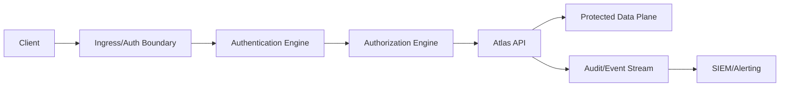

# Security Architecture Diagrams

```mermaid
flowchart LR
    Client --> Gateway[Ingress/Auth Boundary]
    Gateway --> AuthN[Authentication Engine]
    AuthN --> AuthZ[Authorization Engine]
    AuthZ --> API[Atlas API]
    API --> Data[Protected Data Plane]
    API --> Audit[Audit/Event Stream]
    Audit --> SIEM[SIEM/Alerting]
```
