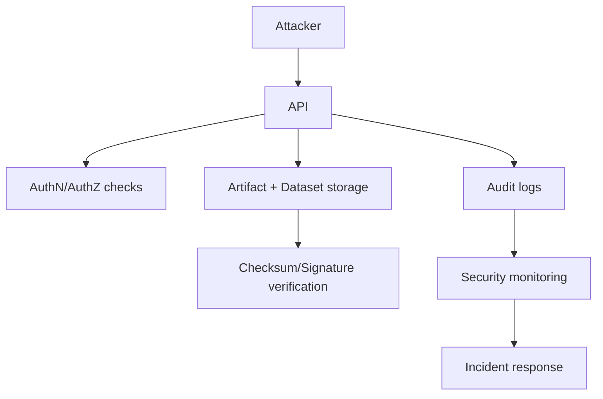

# Threat Model Diagrams

```mermaid
flowchart TD
    Attacker --> API
    API --> AuthChecks[AuthN/AuthZ checks]
    API --> Store[Artifact + Dataset storage]
    Store --> Integrity[Checksum/Signature verification]
    API --> Logs[Audit logs]
    Logs --> Detection[Security monitoring]
    Detection --> Response[Incident response]
```
