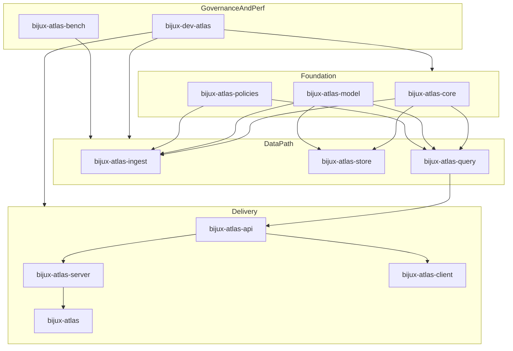

# Why This Structure Exists

## Executive Summary

- This document is the canonical answer to: "Why does this repo look like this?"
- It is architectural, not promotional.
- Separation is a cost; each boundary must earn that cost.
- A boundary is justified when lifecycle, authority, dependency profile, or failure mode differs.
- We merge when separation stops buying clarity, safety, or release independence.
- Repository structure is part of system design, not decoration.
- Contracts and checks enforce these boundaries.
- Determinism, traceability, and operability are primary drivers.
- Flattening names does not remove system complexity; it can hide it.
- We judge structure by failure containment and release clarity, not by directory count.

## Purpose

This document explains why repository boundaries exist, how they map to responsibilities, and what breaks when they are merged incorrectly.

It exists specifically to answer the "overengineering" critique with concrete boundary economics: cost paid vs failure prevented.

## Reading Contract

- This document explains design intent.
- Executable contracts and checks enforce actual behavior.
- If code/contracts diverge from this document, code/contracts are authoritative until this file is updated.

## Who This Is For

- Reviewers validating architecture decisions.
- Contributors adding or changing structural boundaries.
- Operators evaluating operational surface ownership.
- Maintainers deciding whether to split or merge surfaces.

## What This Is Not

- Not a tutorial.
- Not a full runtime architecture specification.
- Not a governance policy manual.

## Repository Design Doctrine

- Deterministic behavior over convenience behavior.
- SSOT through machine-readable authority.
- Control-plane-first automation via `bijux-dev-atlas`.
- Operations treated as a product surface.
- Documentation treated as a product surface.
- Release evidence treated as a product surface.
- Explicit boundaries over implicit coupling.
- Shape must continuously justify itself.

### What Counts As Justified Complexity

Justified complexity prevents a real failure mode and improves containment, traceability, or release safety.

Unjustified complexity has no independent lifecycle, no distinct failure mode, and no independent ownership value.

### When We Separate

- Different public API or consumer contract.
- Different release cadence.
- Different dependency profile.
- Different operational risk envelope.
- Different ownership or evidence surface.

### When We Do Not Separate

- Same lifecycle.
- Same dependency profile.
- Same failure modes.
- No independent reuse.
- No independent release value.

Some concerns are crates because they need compilation and release boundaries. Some concerns are directories because they need ownership and process boundaries. Some concerns are generated because hand-maintaining them is less reliable than regeneration.

## System Layering

## Crate Boundaries And Failure Economics

Separate crate does not always mean public crate. Some crates are separation units for lifecycle containment and verification, even when publication intent differs.

`bijux-dev-atlas` is intentionally separate from `bijux-atlas`: one is repository control-plane authority, the other is user/runtime operator surface.

Core, model, and policies form the anti-drift base. Their separation keeps semantic and policy drift visible early.

| Crate | Responsibility | Why Separate | What Breaks If Merged | Primary Consumers |
| --- | --- | --- | --- | --- |
| `bijux-atlas-core` | Deterministic primitives and invariants | Foundation semantics must stay runtime-agnostic | Semantic drift across ingest/query/store | All runtime and control-plane crates |
| `bijux-atlas-model` | Canonical data model and schema types | Shared type authority must be centralized | Schema drift between ingest/query/api | Ingest, store, query, api, client |
| `bijux-atlas-policies` | Validation and policy evaluation | Policy lifecycle differs from runtime delivery | Policy-runtime coupling and unsafe policy changes | Ingest, query, dev-atlas |
| `bijux-atlas-store` | Persistence and integrity boundaries | IO/backend evolution differs from query/API | Storage concerns leak into query and transport | Query, ingest, server |
| `bijux-atlas-query` | Query planning and execution | Query semantics should not depend on transport | API/server changes alter query behavior | Server, cli, client |
| `bijux-atlas-ingest` | Deterministic ingestion and normalization | Ingestion dependencies and risks are distinct | Serving path polluted by ingestion complexity | CLI, server jobs, tutorials |
| `bijux-atlas-api` | API contracts and wire types | Contract governance needs independent checks | Contract drift hidden in server internals | Server, client, CLI |
| `bijux-atlas-server` | Runtime service process | Runtime ops concerns are distinct from libraries | Library crates inherit server-only constraints | Deployments, operators |
| `bijux-atlas-client` | Rust SDK for API | Consumer compatibility cadence differs | Client users get runtime coupling | Integrators and app teams |
| `bijux-atlas` | User-facing command surface | UX and command lifecycle differ | User UX changes destabilize internals | Operators, contributors |
| `bijux-dev-atlas` | Repo control plane for checks/contracts/docs/ops/release | Governance tooling must not be runtime dependency | Runtime and governance concerns become inseparable | CI, maintainers, contributors |
| `bijux-atlas-bench` | Perf harness and reproducible benchmarks | Benchmark dependencies and cadence are high-churn | Runtime dependency bloat and unstable perf lane | Performance engineering |

## Root Directory Boundaries

Root directories are organizational and authority boundaries, not always runtime boundaries.

| Directory | Role | Why Not Merged Elsewhere | What Breaks If Removed Or Mixed |
| --- | --- | --- | --- |
| `.cargo` | Workspace Cargo behavior and policy | Build policy should be centralized | CI/local build drift |
| `.github` | CI/CD workflows and automation | Automation must be first-class and auditable | Release/check/deploy drift |
| `artifacts` | Generated outputs and evidence | Generated state must be isolated from source | Source pollution and non-reproducible evidence |
| `configs` | Machine-readable SSOT for policy/schema/inventory | Config authority should not be buried in code/docs | Auditable contract enforcement weakens |
| `docker` | Container build/runtime packaging | Container lifecycle differs from crate lifecycle | Packaging hardening becomes opaque |
| `docs` | Reader-facing knowledge surface | Docs should not absorb implementation logic | Discoverability and reader utility degrade |
| `governance` | Policy/process ownership materials | Governance decisions need explicit surface | Ownership and exception rationale become implicit |
| `make` | Stable wrapper entrypoints to control-plane | Command UX needs stable operator interface | Developer flow fragmentation |
| `ops` | Operations-as-product assets | Operational contracts differ from docs/code | Install/validate/runbook integrity loss |
| `packages` | Non-crate packaging surfaces | Distribution beyond Cargo needs separate surface | Language boundary confusion |
| `release` | Release manifests and traceability | Release evidence needs explicit location | Version-to-artifact trace breaks |
| `security` | Security controls and threat surfaces | Security review lifecycle is distinct | Security ownership and auditability weaken |
| `tutorials` | Reality-proof workflows and datasets | Tutorial lifecycle differs from API/runtime internals | Reproducible proof path degrades |
| `.idea` | Local IDE metadata only | Editor-local state should not be architecture surface | Not a product failure mode; keep out of design boundaries |

`packages/` exists because not all distributables are Rust crates. `artifacts/` stays generated-only for determinism. `configs/` stays machine-readable for verification. `docs/` stays reader-facing, and `ops/` stays operational instead of becoming a narrative junk drawer. `make/` remains wrapper-only over the control plane.

## Why `ops/` Is Deep

`ops/` is not an implementation dump. It is an operational product surface. Its depth maps to operational responsibilities, not style preference.

| `ops/` Subdir | Role | What Breaks If Merged Or Ignored |
| --- | --- | --- |
| `_generated` | Generated ops artifacts | Generated-state drift becomes invisible |
| `_generated.example` | Canonical generated examples | Generator output expectations become ambiguous |
| `_templates` | Standard ops templates | Repeated ad hoc runbook/spec formats |
| `api` | Ops API-facing contracts | Runtime/ops contract mismatch |
| `audit` | Audit and readiness reports | No institutional evidence baseline |
| `cli` | Ops command surfaces | Operator command behavior drifts |
| `datasets` | Dataset inputs for ops lanes | Data provenance and repeatability gaps |
| `drift` | Drift detection and reports | Config/environment divergence undetected |
| `e2e` | End-to-end operational scenarios | No operational reality checks |
| `env` | Environment/profile definitions | Ad hoc environment mutation |
| `evidence` | Evidence schema/structure | Reports become unverifiable |
| `governance` | Ops governance rules | Ops changes lose policy traceability |
| `invariants` | Non-negotiable operational invariants | Safety regressions appear late |
| `inventory` | Ops asset inventory | Orphaned/unknown ops surfaces |
| `k8s` | Helm chart/profiles and validation | Installability and rollout risk increases |
| `load` | Load and capacity validation | Capacity regressions unnoticed |
| `observe` | Metrics/log/traces contracts | Diagnostics and SLO control degrade |
| `policy` | Ops policy constraints | Unsafe operational config passes |
| `report` | Aggregated operational outputs | Release/ops decisions lose clear signal |
| `reproducibility` | Reproducibility controls | Runs cannot be trusted or compared |
| `schema` | Ops schema authority | Ops artifact shape drift |
| `security` | Ops security controls | Hardening/compliance drift |
| `stack` | Stack composition manifests | Platform definition becomes ambiguous |

Ops depth is the cost of reproducible and inspectable deployment operations. Flattening this tree reduces visible hierarchy, not actual operational complexity.

## What Breaks If We Merge Aggressively

| Aggressive Merge | Primary Failure Mode |
| --- | --- |
| `core` into runtime crates | Semantic rules become implementation-coupled; determinism drifts silently |
| `model` into ingest/query/server | Data-shape authority fragments across surfaces |
| `policies` into runtime/governance | Policy iteration becomes risky runtime change |
| `query` into API/server | Query semantics become transport-coupled |
| `ingest` into serving path | Dependency contamination in runtime delivery |
| `api` into `server` only | Contract drift becomes harder to detect for clients |
| `cli` and `dev-atlas` collapse | User surface and control-plane authority become ambiguous |
| `ops/` collapsed into ad hoc files | Operational SSOT and install/validation clarity are lost |
| `configs/` moved into code/docs | Machine-verifiable authority and audit trails weaken |
| `release/` removed | Version-to-artifact traceability degrades |
| `security/` removed | Security ownership and review coverage blur |
| `packages/` moved into `crates/` | Language/distribution boundaries become confusing |
| tutorials mixed into narrative/scripts | Reality-proof reproducibility path degrades |

Merging can reduce directory count while increasing hidden coupling. The right question is not "can this merge?" but "which independent failure mode becomes invisible if we merge?" Good separation makes failures cheaper to localize.

## What Is Intentionally Not Separated

- Not every domain gets its own crate.
- Not every docs category becomes a top-level section.
- Generated outputs are not hand-curated trees.
- Thin abstractions without lifecycle value are intentionally kept together.

## What We Are Willing To Merge

- Boundaries that no longer provide lifecycle or release independence.
- Directories that are purely taxonomic and no longer operationally meaningful.
- Crates that lose clear responsibility and add integration tax without safety gain.

## How To Propose A Merge

- State what lifecycle becomes simpler.
- Show failure modes remain visible after merge.
- List contract/check updates required.
- Show evidence quality improves or stays neutral.

## How To Propose A New Boundary

- Define responsibility.
- Define owner.
- Define unique failure mode.
- Define lifecycle difference.
- Define release or verification value.

This system is strict but not frozen. Shape must keep earning itself.

## Decision Examples

- Kept `bijux-dev-atlas` separate from `bijux-atlas` to preserve control-plane authority isolation.
- Kept `configs/` as machine-readable SSOT to enable deterministic checks/contracts.
- Kept `ops/` deep to maintain explicit install/validate/observe ownership boundaries.
- Did not create a separate crate for every docs concern; docs remain directory-scoped, not crate-scoped.

## How To Evaluate This Repository Fairly

Evaluate structure by:

- failure-mode containment
- determinism and repeatability
- release and operations traceability
- clarity of ownership and authority

Do not evaluate structure by raw crate count or directory depth alone.

## Glossary

- Surface: a boundary where users, operators, or tooling interact.
- Authority: the canonical place that defines truth for a concern.
- SSOT: single source of truth for a machine-validated concern.
- Delivery surface: runtime-distributed interfaces (API/server/CLI/client).
- Operational product: deploy/validate/observe/release assets treated as first-class.

## Ownership And Review

- Owner: `architecture`
- Last reviewed: `2026-03-06`
- Update criteria: add/remove crates, add/remove root directories, major `ops/` subdir changes, or boundary/lifecycle model changes.
