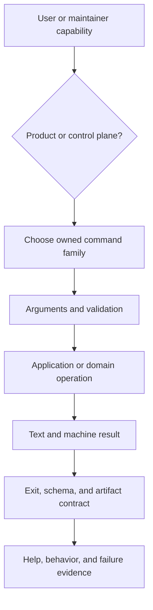
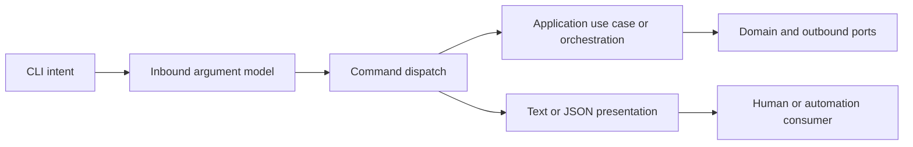

# Adding CLI Surface

Atlas has two command domains. `bijux atlas` and the `bijux-atlas` binary expose
product behavior. `bijux dev atlas` and `bijux-atlas-dev` expose repository,
release, operations, and evidence control. Choose the domain before choosing a
command name; putting maintainer authority in the product CLI creates an
unsupported operational side entrance.

## CLI Addition Flow

A parser entry is only the beginning of the surface. A complete command has an
authority boundary, deterministic inputs, observable mutation policy, stable
failure behavior, and evidence that both direct and umbrella routing reach the
same implementation.

## Placement Model

Clap types, shell wording, and process exit conversion stop at the inbound
boundary. Application and domain code must remain callable without constructing
CLI types. Presentation converts a typed result into the selected format; it
must not silently change the operation's verdict.

## Command Contract

| Concern | Required decision |
| --- | --- |
| Ownership | product CLI or repository control plane, then one durable command family |
| Inputs | precedence, defaults, path resolution, network access, and validation |
| Mutation | read-only, planned, or write-authorized behavior with an explicit boundary |
| Output | human text, JSON shape, artifact paths, and stdout/stderr separation |
| Failure | usage, validation, dependency, or internal exit class plus machine code |
| Idempotency | whether rerunning is safe and how partial state is detected |
| Evidence | tests and reports proving success, failure, help, and routing behavior |

Do not create a generic root family to avoid an ownership decision. Extend the
domain that owns the state or operation. If no family fits, document the new
boundary and its relationship to adjacent commands before adding it.

## Machine and Human Output

JSON is an automation contract, not decorated console text. Use stable field
names, explicit status, governed report schemas when results persist, and
deterministic ordering where consumers compare output. Send diagnostics to
stderr so stdout remains parseable. Human output may add explanation but must
preserve the same verdict and identities.

Use the shared exit classes consistently: `0` success, `2` usage, `3`
validation, `4` dependency failure, and `10` internal failure. A newly created
report does not justify exit `0` when its governing check failed.

## Acceptance Evidence

- Help exposes the command in the intended family with meaningful option text.
- Direct binary and umbrella routes resolve to equivalent behavior where both
  are supported.
- Missing, invalid, and conflicting inputs return the correct stable exit class.
- JSON output parses and matches its declared schema or field contract.
- Mutating behavior requires the repository's established write authorization
  and leaves no unexplained partial state.
- Tests exercise a successful result, representative rejection, and dependency
  failure without relying only on snapshots of prose.
- Reader documentation states prerequisites, effects, completion evidence, and
  what the command does not prove.

Review the broader [Automation Command Surface](automation-command-surface.md)
and [Command Routing](command-routing.md) before establishing a new family.
