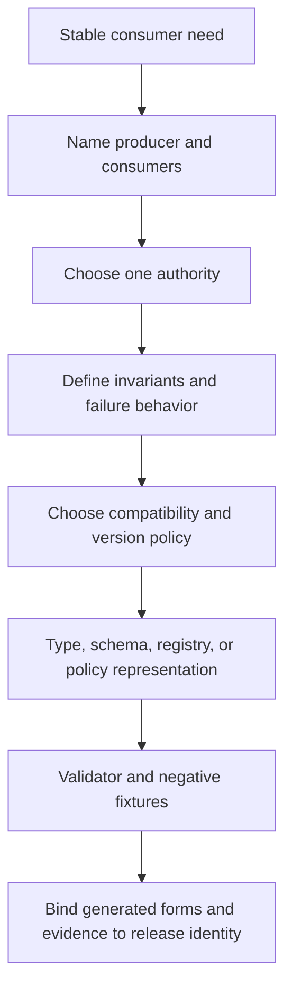
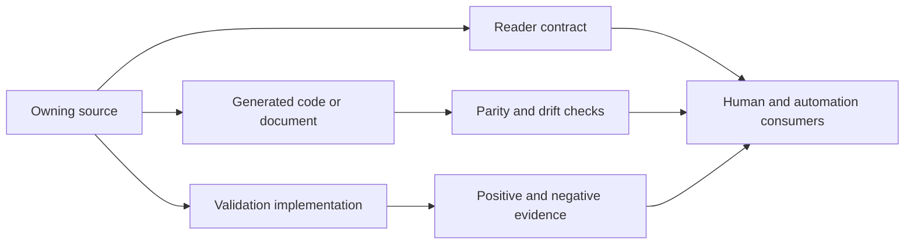
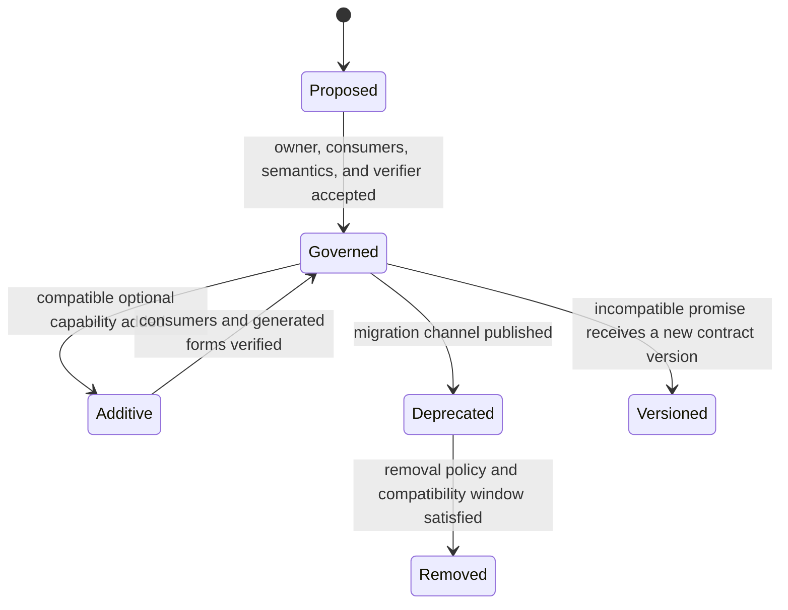

# Adding Contracts

Contracts turn Atlas behavior into a promise that a producer, consumer, owner,
and verifier can name. A type or JSON file becomes a governed contract only
when its authority, versioning, compatibility, validation, and release binding
are explicit.

## Contract Addition Flow

A contract is incomplete when only valid examples pass. Negative fixtures must
prove that unknown fields, invalid identities, missing requirements, or
forbidden transitions fail at the owning boundary.

## Ownership Model

Generated Rust, JSON, OpenAPI, Markdown tables, and snapshots are projections
unless the domain explicitly assigns them authority. Mark their provenance and
regenerate them from the owner. Hand-editing two representations until they
agree creates duplicate truth and makes drift inevitable.

## Choose the Contract Form

| Form | Best suited for | Required companion |
| --- | --- | --- |
| Rust type and invariant | behavior owned inside one compiled boundary | semantic tests and stable serialization policy if exported |
| JSON Schema | external or cross-language document shape | strict validator, version field, and invalid fixtures |
| Registry | closed or governed identifiers and ownership metadata | uniqueness, completeness, and generated parity checks |
| Policy document | thresholds, allowed transitions, or release decisions | evaluator with explicit pass, fail, and invalid outcomes |
| Golden artifact | exact deterministic representation | authoritative generator and intentional review process |
| Protocol description | HTTP or plugin interaction | compatibility tests and live implementation parity |

Do not use a golden file to stand in for semantics it cannot express, or a
schema to claim values were operationally exercised. Structural validity,
semantic validity, and execution evidence are different layers.

## Evolution Model

Adding an enum value, required field, route, default, or validation rule can be
incompatible even when parsing still succeeds. Review producer and consumer
behavior, not only schema syntax. Record how unknown versions and fields are
handled before publishing the contract.

## Acceptance Evidence

- One owning source and owner are discoverable.
- Producers and consumers are named, including generated and external users.
- Version, unknown-field, default, and compatibility behavior are explicit.
- Positive, boundary, and negative fixtures exercise semantic validation.
- Generated projections are reproducible and fail parity checks when stale.
- Machine failures use stable codes and distinguish invalid input from tool or
  dependency failure.
- Reader documentation explains the promise, enforcement point, limitations,
  and migration behavior.
- Release evidence identifies the contract and verifier versions used for the
  candidate.

Continue with [Automation Contracts](../governance/automation-contracts.md)
and [Evidence Contracts](../governance/evidence-contracts.md) for the control
plane's own promises.
