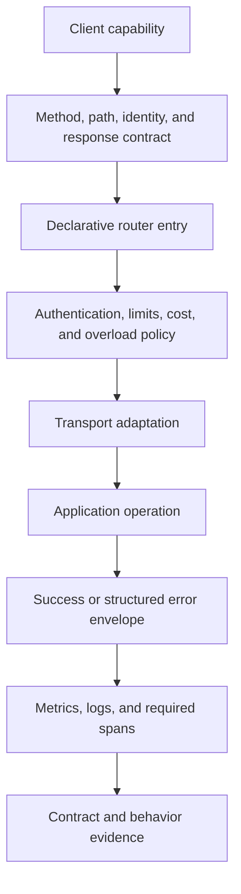
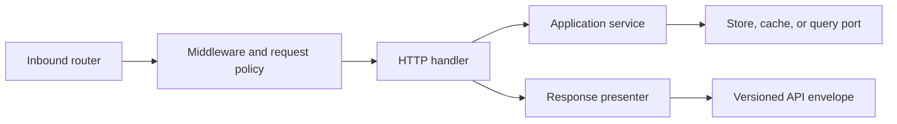
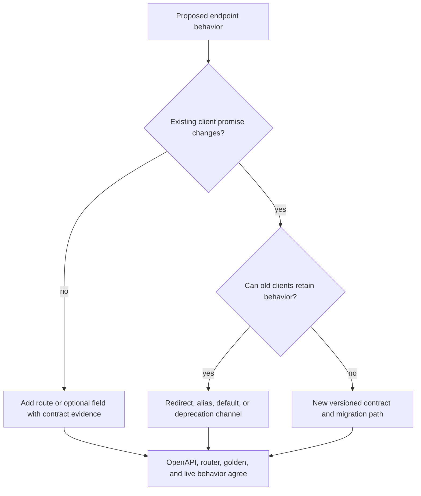

# Adding HTTP Surface

A new Atlas endpoint is a public contract across routing, request policy,
dataset identity, execution, presentation, observability, and compatibility.
Adding a handler without those bindings creates a route that operators cannot
govern and clients cannot safely automate.

## HTTP Addition Flow

Define the contract before implementation so review can distinguish intended
behavior from incidental handler behavior. Dataset-aware routes must say how
release, species, and assembly are selected and returned.

## Layering Model

Path extraction, headers, HTTP status, and response caching belong at the HTTP
boundary. Reusable query, catalog, validation, and policy behavior belongs in
application or domain ownership. A backend adapter must not decide public error
wording or status codes.

## Contract Checklist

| Surface | Required definition |
| --- | --- |
| Request | method, canonical path, parameters or body, defaults, limits, and unknown-field policy |
| Dataset | required identity dimensions, resolution rules, and provenance returned |
| Success | status, response envelope, pagination, caching, and content type |
| Failure | stable codes, statuses, details, request ID, and retry semantics |
| Policy | authentication, authorization, cost class, rate limit, response limit, and overload behavior |
| Observability | canonical route label, request class, metrics, log events, and required spans |
| Compatibility | API version, redirect or deprecation needs, and client migration boundary |

The endpoint observability contract classifies routes as cheap, medium, or
heavy. That class drives required spans and helps overload policy preserve
cheap survival paths. It must be reviewed with the route, not inferred later
from production latency.

## Compatibility Decision

Do not keep two paths authoritative. A compatibility route redirects or adapts
to one canonical route and preserves query parameters under its declared
policy. Deprecation needs a discoverable migration target and removal policy.

## Acceptance Evidence

- Router and generated OpenAPI agree on method, path, request, response, and
  error surface.
- Success, malformed input, missing dataset, policy rejection, overload, and
  dependency failure have contract tests where applicable.
- Responses preserve `x-request-id` and `x-trace-id`; structured errors carry
  the same correlation identity.
- Observability tests establish the canonical route label, bounded metric
  labels, required events, and trace structure.
- Security resilience covers input limits and authentication or authorization
  behavior owned by the route.
- Public interface documentation gives a runnable request and explains the
  dataset, provenance, pagination, and retry boundaries.

Use [API Compatibility](../../bijux-atlas/contracts/api-compatibility.md) for
the review policy and [API Endpoint Index](../../bijux-atlas/interfaces/api-endpoint-index.md)
for the public route inventory.
