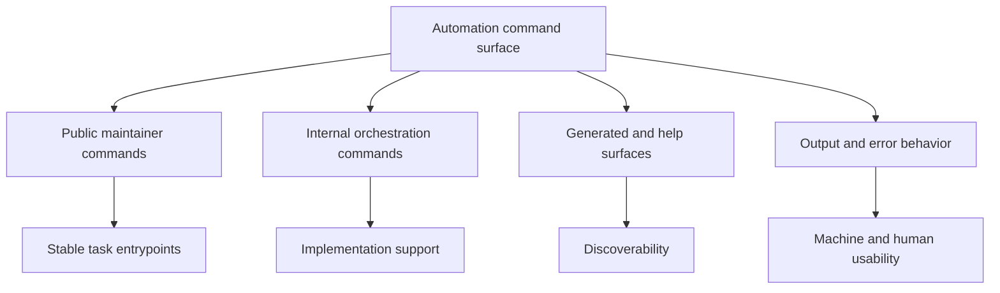

# Automation Command Surface

This page summarizes the current maintainer command families and the stable wrapper entrypoints
around them. Its job is to help maintainers tell the difference between a supported task entrypoint,
an internal orchestration detail, and a generated discovery surface.

The installed maintainer namespace is `bijux dev atlas ...`.
The direct binary remains `bijux-dev-atlas`.

## Primary Entrypoints

- `bijux dev atlas`: the canonical installed repository automation namespace
- `bijux-dev-atlas`: the direct repository automation binary
- `make ci-fast`: fast feedback lane wrapper
- `make ci-pr`: pull-request lane wrapper
- `make ci-nightly`: broader nightly lane wrapper
- `make docs-build`: docs build wrapper

These entrypoints are listed together because Atlas treats them as one maintainer-facing automation
surface, with `bijux dev atlas` as the canonical root and `make` as the thin convenience wrapper.

## Command Surface Model



This diagram is the key distinction for this page. Not every command that exists in the binary is a
recommended maintainer starting point, and not every generated listing should be treated like a
long-term contract.

## Who This Page Is For

- maintainers choosing the right entrypoint for local validation, release work, docs work, or governance review
- reviewers checking whether a change adds a stable command, changes an existing contract, or only reshapes internal wiring
- docs authors updating references, examples, or generated command inventories

## Global Options

The top-level binary exposes common flags that show up across most command families:

- `--output-format human|json|both` for renderer selection
- `--json`, `--quiet`, `--verbose`, and `--debug` for output control
- `--repo-root <path>` when a command needs an explicit workspace root
- `--no-deprecation-warn` when you need quiet automation output

## Discovery Commands

Use these commands when you need to inspect what the control plane knows before you execute anything:

```bash
bijux dev atlas list --format json
bijux dev atlas check list
cargo run -q -p bijux-dev-atlas -- list --format json
cargo run -q -p bijux-dev-atlas -- describe --help
cargo run -q -p bijux-dev-atlas -- check list
cargo run -q -p bijux-dev-atlas -- suites list --format json
```

## Main Command Families

- `check`: list, explain, run, or doctor individual checks
- `suites`: list, run, describe, diff, and inspect grouped execution lanes
- `reports`: list governed report families, build indexes, inspect progress, and validate report directories
- `docs`: validate, build, serve, lint, inventory, reference, generate, and redirect docs artifacts
- `governance`: inspect rules, validate governance state, check doctrine, inspect deprecations, and build ADR indexes
- `validate`, `run`, and `list`: generic execution and discovery helpers for registry-backed surfaces
- domain families such as `ops`, `security`, `perf`, `tests`, `tutorials`, `configs`, and `registry` expose narrower workflows in their area

## Stability Boundaries

- treat `bijux dev atlas`, the major documented command families, and the curated `make` wrappers as the maintainer-facing stable surface
- treat hidden commands, aliases, and internal orchestration helpers as implementation detail unless another canonical page explicitly promotes them
- treat generated listings, help output, and indexes as derived reference artifacts that must stay aligned with the authored command surface
- treat output shape, error behavior, and report schemas as part of the contract when automation or CI consumes them

## Selection and Execution Flags

The most important execution selectors are:

- `--suite <name>` for suite-backed selection
- `--tag <tag>`, `--domain <domain>`, `--id <id>`, and `--name <name>` for focused check execution
- `--mode static|effect` on `check run`
- `--mode pure|effect|all` on `suites run`
- `--format text|json|jsonl` when the command owns a machine-readable report format

## Capability Flags

Effectful commands fail closed unless the required capability is explicitly allowed.

- `--allow-subprocess` for shelling out to external tools
- `--allow-write` for generating or updating artifacts
- `--allow-network` for network-dependent commands
- `--allow-git` for commands that need explicit git access

## Current Suite and Report Anchors

As of March 15, 2026, the stable suite ids exposed by `suites list --format json` are:

- `checks`
- `contracts`
- `tests`

The current top-level `reports` catalog includes report families such as `closure-index`, `docs-build-closure-summary`, `docs-site-output`, `helm-env`, and `ops-profiles`.

## What Must Change When The Surface Changes

When a maintainer-facing command family changes, update the command surface as a coordinated unit:

- the clap surface in [`crates/bijux-dev-atlas/src/interfaces/cli/mod.rs`](/Users/bijan/bijux/bijux-atlas/crates/bijux-dev-atlas/src/interfaces/cli/mod.rs:1)
- the governed registry in [`configs/sources/governance/governance/cli-dev-command-surface.json`](/Users/bijan/bijux/bijux-atlas/configs/sources/governance/governance/cli-dev-command-surface.json:1)
- the owning reference or guide page under [`docs/bijux-atlas-dev`](/Users/bijan/bijux/bijux-atlas/docs/bijux-atlas-dev)
- any generated help, reports, or inventory artifacts that expose the changed family
- any CI, docs, or maintainer workflow that relies on the old output shape, command name, or routing path

If the change only affects internal orchestration, keep it out of maintainer-facing examples. If it
affects documented commands or machine-consumed output, treat it as a compatibility-reviewed
surface change.

## Main Takeaway

Atlas keeps one automation namespace, but that namespace contains different kinds of surfaces. Good
maintainer docs make the supported entrypoints obvious, keep internal plumbing out of the spotlight,
and force command changes to update the code, governance metadata, and reader docs together.

## Related Pages

- [Automation Reports Reference](automation-reports-reference.md)
- [Automation Control Plane](automation-control-plane.md)
- [Automation Contracts](../governance/automation-contracts.md)

## Purpose

This page is the lookup reference for automation command surface. Use it when you need the current checked-in surface quickly and without extra narrative.

## Stability

This page is a checked-in reference surface. Keep it synchronized with the repository state and generated evidence it summarizes.
