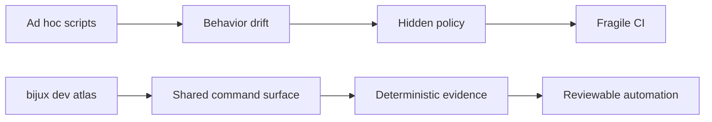
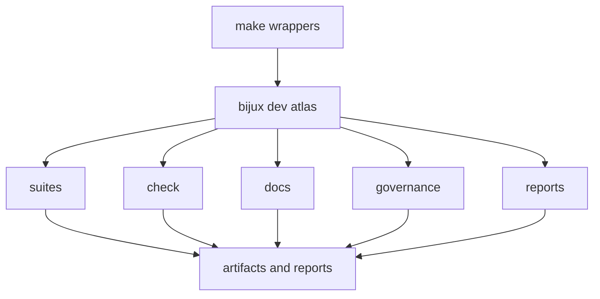
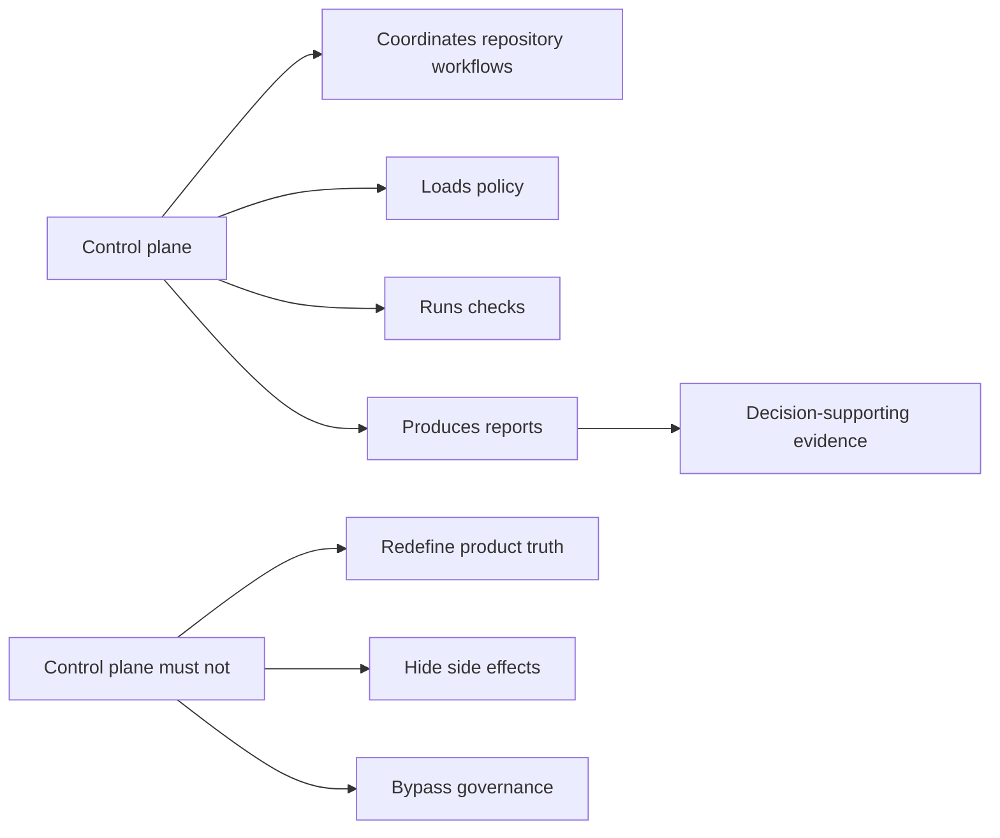

# Automation Control Plane

Atlas uses `bijux dev atlas ...` as the canonical installed automation surface for repository
checks, docs workflows, governance validation, and machine-readable evidence. The direct binary that
backs that namespace is `bijux-dev-atlas`, and `make` remains the convenience wrapper for the most
common maintainer lanes.

## Why This Exists



The goal is simple: one execution surface, one capability model, and one place to document automation behavior.

This contrast diagram explains why Atlas invests in a control plane instead of accumulating scripts.
Shared commands and explicit capabilities keep local runs, CI, and docs closer to the same truth.

## Surface Model



This surface model shows how `make` and `bijux dev atlas` relate. `make` is the ergonomic wrapper;
the control plane is the authoritative execution surface.

Use `make` for the common lane wrappers and `bijux dev atlas ...` when you need narrower selection or deeper inspection.

## Governance Boundaries



This governance diagram captures the promise and the restraint. The control plane is the place
where maintainers ask the repository to do work, not the place where repository truth is invented
or policy is quietly weakened.

## Authority Chain

- `make ci-fast`, `make ci-pr`, `make ci-nightly`, and `make docs-build` are curated maintainer shortcuts
- `bijux dev atlas ...` is the canonical installed namespace for repository automation
- `cargo run -q -p bijux-dev-atlas -- ...` is the direct binary path when you need exact command parity inside the repo
- [`crates/bijux-dev-atlas/src/interfaces/cli/mod.rs`](/Users/bijan/bijux/bijux-atlas/crates/bijux-dev-atlas/src/interfaces/cli/mod.rs:1) defines the command families and global flags
- [`configs/sources/governance/governance/cli-dev-command-surface.json`](/Users/bijan/bijux/bijux-atlas/configs/sources/governance/governance/cli-dev-command-surface.json:1) records the governed top-level command surface
- generated reports and indexes are evidence outputs; they are not a substitute for the authored rules they summarize

## Lane and Selection Rules

The broad workflow is:

- `make ci-fast` for fast local feedback
- `make ci-pr` for the pull-request lane
- `make ci-nightly` for broader and slower coverage
- `make docs-build` for docs-specific build validation

The narrow workflow is:

```bash
bijux dev atlas suites list
bijux dev atlas check list
cargo run -q -p bijux-dev-atlas -- suites list
cargo run -q -p bijux-dev-atlas -- check run --suite ci_pr --include-internal --include-slow --allow-git --format json
cargo run -q -p bijux-dev-atlas -- check list
cargo run -q -p bijux-dev-atlas -- check run --tag lint --format json
```

Pick the smallest surface that matches the question you are answering. Do not bypass required lanes by inventing a different command path.

## Static and Effect Boundaries

Some workflows are pure reads, while others intentionally require effects.

- `check run` declares `static` versus `effect` execution modes
- `suites run` can be constrained with `--mode pure`, `--mode effect`, or `--mode all`
- docs commands that spawn tools or write artifacts require explicit capability flags such as `--allow-subprocess`, `--allow-write`, and `--allow-network`

Commands should fail closed when a required capability is missing. Quietly downgrading behavior would make CI and local evidence diverge.

## How Maintainers Should Choose A Path

Use this quick routing model when you are deciding where to start:

- choose `make` when the question is "run the standard lane"
- choose `bijux dev atlas suites ...` when the question is "run the maintained group of checks"
- choose `bijux dev atlas check ...` when the question is "inspect or rerun one governed check"
- choose `bijux dev atlas governance ...` or `... reports ...` when the question is "show me the rule state or the evidence set"
- choose the direct `cargo run -q -p bijux-dev-atlas -- ...` form when you need repo-local parity, debugging, or a command that has not been installed globally

The main discipline is to keep command choice aligned with the question you are answering. Fast
feedback, governed suites, focused checks, and evidence lookup are different maintainer jobs and
deserve different entrypoints.

## A Useful Control-Plane Question

Ask whether you need a lane wrapper, a suite, a focused check, or a report lookup. Picking the
smallest correct control-plane surface keeps automation both honest and fast.

## Triage Workflow

When automation fails:

1. Re-run the matching wrapper or suite first.
2. Prefer JSON output when the lane consumes structured reports.
3. Inspect the named check, suite, or report before changing code.
4. Apply the smallest fix that restores the documented contract.
5. Re-run the focused command and then the broader lane.

Common entry points:

```bash
make ci-pr
make docs-build
cargo run -q -p bijux-dev-atlas -- governance check --format json
cargo run -q -p bijux-dev-atlas -- reports index --format json
```

## Operational Guardrails

- repository automation should be routed through `bijux dev atlas ...`, not ad hoc root scripts
- expensive or environment-sensitive validations belong in the correct lane, not hidden inside fast feedback loops
- external tools and capability requirements should fail with remediation, not with mystery
- evidence should describe the failure, the rerun command, and the relevant artifact path

## Main Takeaway

Treat the control plane as Atlas's maintainer operating console. It coordinates checks, docs work,
governance review, and evidence generation, but it must stay visibly bound to authored policy,
declared capabilities, and reviewable outputs.

## Where to Go Next

- [Contributor Workflow](../workspace/contributor-workflow.md)
- [Testing and Evidence](../governance/testing-and-evidence.md)
- [Automation Command Surface](automation-command-surface.md)

## Purpose

This page explains the Atlas material for automation control plane and points readers to the canonical checked-in workflow or boundary for this topic.

## Stability

This page is part of the canonical Atlas docs spine. Keep it aligned with the current repository behavior and adjacent contract pages.
