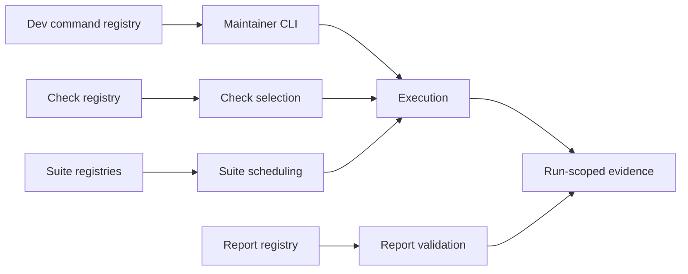
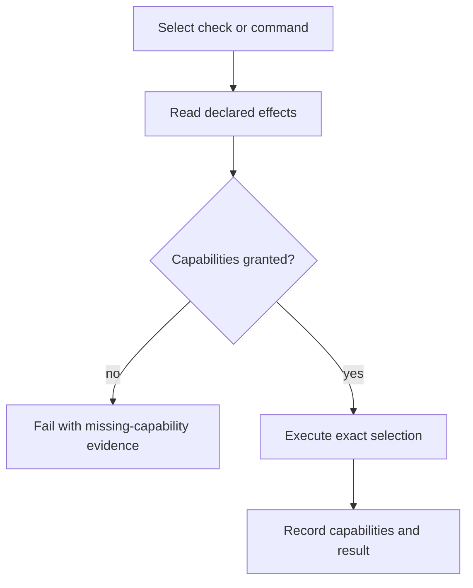
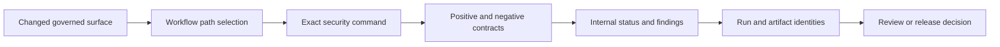

# Automation Control Plane

`bijux dev atlas ...` is the installed maintainer interface for Atlas. The
`bijux-atlas-dev` binary implements the same control plane inside the repository.
It discovers governed checks and suites, enforces effect capabilities, and
writes structured evidence under the selected artifact root.

The control plane coordinates repository work. It does not redefine product
contracts, waive policy, or turn a generated report into its own authority.

## Sources of Authority


```mermaid
flowchart LR
    CommandRegistry[Dev command registry] --> CLI[Maintainer CLI]
    CheckRegistry[Check registry] --> Selection[Check selection]
    SuiteRegistry[Suite registries] --> Scheduling[Suite scheduling]
    ReportRegistry[Report registry] --> Validation[Report validation]
    CLI --> Run[Execution]
    Selection --> Run
    Scheduling --> Run
    Run --> Evidence[Run-scoped evidence]
    Validation --> Evidence
```

| Concern | Governing source | What it decides |
| --- | --- | --- |
| public top-level commands | `configs/sources/governance/governance/cli-dev-command-surface.json` | which command families belong to the maintainer surface. |
| registered checks | `configs/sources/governance/governance/checks.registry.json` | check identity, owner, severity, mode, tags, suites, budgets, and evidence paths. |
| executable suites | `configs/sources/governance/governance/suites/` | suite membership, ordering, execution mode, and report declarations. |
| governed reports | `configs/registry/reports/reports.registry.json` | report identity, version, schema, and example path. |
| common lane wrappers | `makes/ci.mk` and domain make fragments | reviewed shortcuts to exact control-plane commands. |

Generated indexes and reports observe those sources. When an index disagrees
with its registry, fix or regenerate the derived artifact; do not treat the
index as a competing rule set.

## Select the Narrowest Surface

| Question | Command |
| --- | --- |
| What checks exist for this domain or tag? | `bijux dev atlas check list --domain <domain> --format json`. |
| Why does one check exist? | `bijux dev atlas check explain <check-id> --format json`. |
| Can I rerun only one check? | `bijux dev atlas check run --id <check-id> --format json`. |
| What executable suites exist? | `bijux dev atlas suites list --format json`. |
| What belongs to a suite? | `bijux dev atlas suites describe --suite <suite> --format json`. |
| Which report contracts are registered? | `bijux dev atlas reports list --format json`. |
| Are the public docs structurally valid? | `bijux dev atlas docs validate --format json`. |
| Is the governed threat registry internally coherent? | `bijux dev atlas security threats verify --format json`. |

There are two distinct uses of the word *suite*. `check run --suite ci_fast`
filters the check registry by lane membership. `suites run --suite checks`
executes the named suite registry with scheduling and suite-result artifacts.
Inspect the selected surface before assuming the two are interchangeable.

## Capabilities Are Explicit

Effectful operations fail closed unless the invocation grants the required
capability.

| Capability | Flag | Typical effect |
| --- | --- | --- |
| subprocess | `--allow-subprocess` | invoke compilers, MkDocs, scanners, or other tools. |
| filesystem write | `--allow-write` | generate, update, or remove governed outputs. |
| Git | `--allow-git` | inspect repository history or state beyond ordinary file reads. |
| network | `--allow-network` | reach registries, links, services, or remote dependencies. |


```mermaid
flowchart TD
    Select[Select check or command] --> Declared[Read declared effects]
    Declared --> Granted{Capabilities granted?}
    Granted -- no --> Refuse[Fail with missing-capability evidence]
    Granted -- yes --> Execute[Execute exact selection]
    Execute --> Record[Record capabilities and result]
```

A capability flag authorizes an effect; it does not make every effect happen.
Retained evidence should record both the declared requirements and the granted
capabilities so another maintainer can reproduce the run.

## Make Wrappers

Make targets are curated shortcuts, not a second execution engine:

```bash
make ci-fast       # check run --suite ci_fast
make ci-pr         # check run --suite ci_pr with Git access
make ci-nightly    # check run --suite ci_nightly
make ci-docs       # check run --suite docs_required
make docs-build    # docs sync plus capability-gated docs build
```

Use a wrapper when its complete lane is the question. Use a focused control-plane
command when one contract, page family, check, or report is the question. A
focused pass does not claim the broader lane passed.

## Security Selection and Evidence Custody

Security automation has two selections: which change triggers a lane, and
which contracts execute inside it. Both selections are part of the evidence.


```mermaid
flowchart LR
    Change[Changed governed surface] --> Trigger[Workflow path selection]
    Trigger --> Command[Exact security command]
    Command --> Contracts[Positive and negative contracts]
    Contracts --> Status[Internal status and findings]
    Status --> Receipt[Run and artifact identities]
    Receipt --> Decision[Review or release decision]
```

The threat-model lane watches the governed model, command implementation and
routing, and the public security pages that state its controls. It runs
`security threats verify` and the `security_threat_` contract selector. The
selector covers both accepted registry linkage and rejection of a mismatched
registry.

Preserve these distinctions during triage:

| Observation | Meaning |
| --- | --- |
| path did not trigger the lane | no lane observation exists for that revision |
| command did not execute | lane execution is incomplete even if another step passed |
| test filter ran zero tests | selector matched no contract and supplies no behavioral evidence |
| report exists with non-passing status | findings were transported, not accepted |
| model verification passed | governed records agree; live enforcement remains outside this command |

When a public security claim changes without a model or implementation change,
the documentation path still triggers the threat lane. This guards consistency
between published control claims and the governed registry, but it does not
prove the prose itself through runtime execution. Reviewers must compare the
claim with the report and the implementation evidence it cites.

## Failure Triage

1. Preserve the failing command, exit code, selected IDs, and artifact root.
2. Read the structured failure and the owning check or report registry entry.
3. Re-run the smallest matching selector with the same capabilities.
4. Correct the governing input or implementation, not the generated symptom.
5. Re-run the focused selector before returning to its containing lane.

Do not broaden a run merely to discover which check failed; the control plane
already exposes IDs, owners, rationale, fix hints, budgets, and evidence paths.

Continue with [Automation Command Surface](automation-command-surface.md) for
command families and [Automation Reports Reference](automation-reports-reference.md)
for evidence interpretation. Use
[Security Validation Lanes](../delivery/security-validation-lanes.md) for
trigger, selector, and acceptance boundaries.
