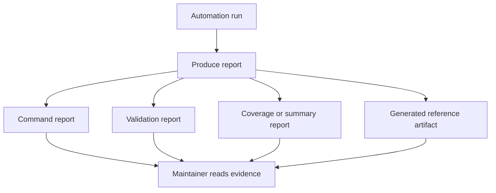

# Automation Reports Reference

This page describes the report artifacts exposed by the Atlas development control plane.

## Report Flow



This diagram is the key mental model for the page. Reports are not random files
left behind by commands; they are named evidence products that help maintainers
understand what happened, what was checked, and what another workflow may rely
on next.

## Report Commands

Use the `reports` command family for catalog and validation tasks:

```bash
cargo run -q -p bijux-dev-atlas -- reports list --format json
cargo run -q -p bijux-dev-atlas -- reports index --format json
cargo run -q -p bijux-dev-atlas -- reports progress --format json
cargo run -q -p bijux-dev-atlas -- reports validate --dir artifacts
```

These commands belong together because the reports surface is both discoverable and governed. Readers
should be able to list report families, inspect indexes, and validate report directories from one
documented command family.

## Repository Anchors

- command dispatch for the `reports` family lives in [`src/interfaces/cli/dispatch.rs`](/Users/bijan/bijux/bijux-atlas/crates/bijux-dev-atlas/src/interfaces/cli/dispatch.rs:951)
- contract schemas for governed report families live under [`configs/schemas/contracts/reports/`](/Users/bijan/bijux/bijux-atlas/configs/schemas/contracts/reports)
- docs-oriented report generation is implemented in [`src/docs/site_output.rs`](/Users/bijan/bijux/bijux-atlas/crates/bijux-dev-atlas/src/docs/site_output.rs:1)
- ops-oriented report generation is implemented in [`src/ops/helm_env.rs`](/Users/bijan/bijux/bijux-atlas/crates/bijux-dev-atlas/src/ops/helm_env.rs:1) and [`src/ops/profiles_matrix.rs`](/Users/bijan/bijux/bijux-atlas/crates/bijux-dev-atlas/src/ops/profiles_matrix.rs:1)

## Shared Report Header

Governed report schemas under `configs/schemas/contracts/reports/` consistently require these fields:

- `report_id`: stable report family identifier
- `version`: schema version for the report family
- `inputs`: declared inputs used to produce the report
- `summary`: top-level counters or state
- `evidence`: supporting metadata needed to interpret the result

Report-specific payload fields appear after that shared header. For example, `docs-site-output` adds
fields such as `docs_dir`, `site_dir`, `checks`, `counts`, `assets_directory`, and `status`.

## Current Governed Report Families

The current `reports list --format json` catalog exposes at least these report ids:

- `closure-index`
- `docs-build-closure-summary`
- `docs-site-output`
- `helm-env`
- `ops-profiles`

Each catalog entry points to both a schema in `configs/schemas/contracts/reports/` and an example artifact path.

These families already show the main report classes maintainers should expect:

- docs and closure evidence such as `closure-index` and `docs-site-output`
- environment and profile evidence such as `helm-env` and `ops-profiles`
- summary-style reports that help another workflow or reviewer decide what to inspect next

## Artifact Path Pattern

Most generated reports live under workspace-controlled artifact roots such as:

- `artifacts/run/<run_id>/...` for run-scoped execution outputs
- `artifacts/contracts/ops/...` for contract-oriented artifacts
- `artifacts/governance/...` for governance indexes such as the ADR catalog

Treat those paths as report storage locations, not as new sources of truth. The contract lives in the schema and in the command that emits the report.

## Validation Rules

- schema changes must stay backward compatible unless the report version changes
- consumers should key off structured fields, not terminal formatting
- report validation should happen against a directory root, not through manual spot checks
- unknown additive fields should not break tolerant consumers

## Main Takeaway

Automation reports are Atlas's evidence layer for maintainer work. The command
surface, the schema contracts, and the generated report artifacts all have to
stay aligned or the report stops being trustworthy as a decision input.

## Related Pages

- [Automation Command Surface](automation-command-surface.md)
- [Automation Contracts](../governance/automation-contracts.md)

## Purpose

This page is the lookup reference for automation reports reference. Use it when you need the current checked-in surface quickly and without extra narrative.

## Stability

This page is a checked-in reference surface. Keep it synchronized with the repository state and generated evidence it summarizes.
