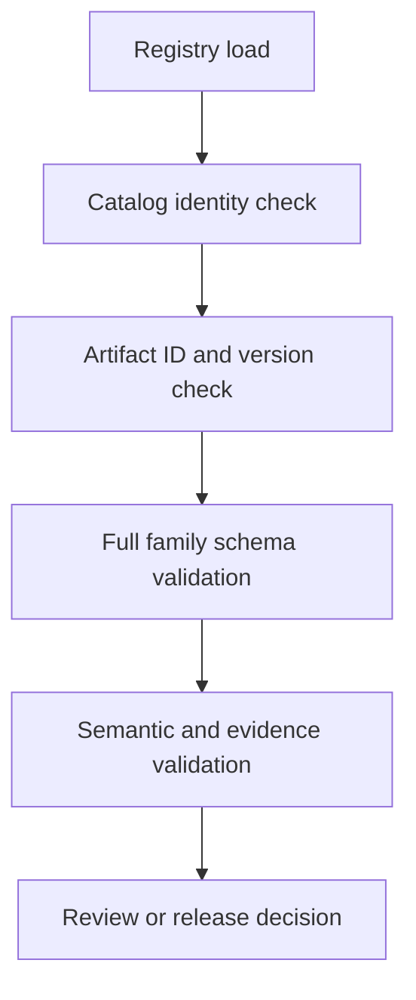

# Automation Reports Reference

Atlas reports are named evidence artifacts. A governed report has an identity,
an integer version, a JSON Schema, and an example location recorded in
`configs/registry/reports/reports.registry.json`.

## Governed Catalog

The current report catalog contains five families:

| Report ID | Evidence supplied | Example location |
| --- | --- | --- |
| `closure-index` | index of documentation closure evidence. | `artifacts/docs/generated/closure-index.json`. |
| `docs-build-closure-summary` | build-closure status and checks for one docs gate run. | `artifacts/run/<run_id>/gates/docs/docs-build-closure-summary.json`. |
| `docs-site-output` | rendered-site paths, counts, checks, and status. | `artifacts/run/<run_id>/gates/docs/site-output.json`. |
| `helm-env` | the governed relationship between Helm inputs and runtime environment keys. | `artifacts/contracts/ops/helm/helm-env-subset.json`. |
| `ops-profiles` | operational profile matrix, tool identity, and validation summary. | `artifacts/contracts/ops/profiles/full-matrix.json`. |

Each registered schema fixes `report_id` and `version` and rejects additional
top-level properties. The required payload fields differ by family. In
particular, `helm-env` and `ops-profiles` do not use the same `evidence` header
as the documentation closure reports. Consumers must validate the exact schema.

The repository contains other report schemas, including suite, governance,
compatibility, and exception reports. They are not currently entries in the
`reports` catalog and therefore are not discoverable or accepted through this
command family.

## Report Commands

```bash
bijux dev atlas reports list --format json
bijux dev atlas reports index --format json
bijux dev atlas reports progress --format json
bijux dev atlas reports validate \
  --dir artifacts/contracts/ops \
  --format json
```

| Command | What it establishes | What it does not establish |
| --- | --- | --- |
| `reports list` | the registry parses; registered schema files exist; schema constants match registered IDs and versions. | example existence, artifact payload conformance, or producer correctness. |
| `reports index` | renders registry entries as Markdown. | validation beyond the registry load. |
| `reports progress` | reports blank example paths and missing schema files. | whether a non-empty example path exists or contains a valid report. |
| `reports validate --dir` | every JSON file has a registered string `report_id` and the registered integer `version`. | full JSON Schema validation, required payload fields, field types beyond ID/version, or evidence quality. |

Use `reports validate` only on a directory intended to contain registered
report artifacts. It recursively treats every JSON file in the selected tree as
a report candidate.

## Validation Depth


```mermaid
flowchart TD
    Registry[Registry load] --> Catalog[Catalog identity check]
    Catalog --> Identity[Artifact ID and version check]
    Identity --> Schema[Full family schema validation]
    Schema --> Meaning[Semantic and evidence validation]
    Meaning --> Decision[Review or release decision]
```

The `reports` family currently implements the first three nodes through the
artifact identity check; it does not implement the full family-schema node for
arbitrary report directories. Domain commands and focused checks may provide
deeper validation for the artifacts they own.

Do not describe a directory as schema-valid solely because `reports validate`
passes. Record which validator reached which depth.

## Artifact Governance

The hidden `artifacts report` surface performs a different repository-wide
audit. Its validation checks report registration in the larger schema inventory,
ownership, check mapping, summary/evidence presence, count limits, and byte
budgets. It also does not replace exact JSON Schema validation.

These surfaces answer different questions:

- `reports ...` governs the small public report catalog;
- `artifacts report ...` governs retained artifact discipline across a wider
  inventory;
- domain validators establish the semantics of the report they produce;
- exact JSON Schema validation establishes payload shape.

## Consume a Report

1. Identify `report_id` and `version` without coercion.
2. Resolve the pair through the report registry.
3. Validate the complete payload against the registered schema.
4. Confirm the producer command, inputs, run ID, and artifact digest.
5. Inspect report-specific status, summary, and evidence semantics.
6. Retain the original bytes; do not edit a failing report into conformance.

A valid shape does not prove a passing result. A passing status does not prove
the artifact belongs to the candidate under review. Both shape and identity
must be connected to the originating run.

See [Automation Contracts](../governance/automation-contracts.md) for
compatibility rules and [Testing and Evidence](../governance/testing-and-evidence.md)
for the evidence chain.
