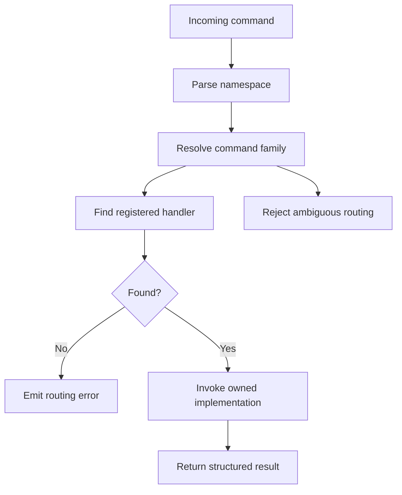

# Command Routing

`bijux-dev-atlas` routes commands by domain so docs, release, governance, and
ops surfaces stay explicit instead of collapsing into one command blob.

## Routing Model

This page matters because routing discipline is what keeps the control plane understandable years
later. Good routing makes it obvious where a command belongs, who owns it, and what docs page should
explain it.

## Repository Anchors

- [`crates/bijux-dev-atlas/src/interfaces/cli/mod.rs`](/Users/bijan/bijux/bijux-atlas/crates/bijux-dev-atlas/src/interfaces/cli/mod.rs:1) defines the top-level command families
- [`configs/sources/governance/governance/cli-dev-command-surface.json`](/Users/bijan/bijux/bijux-atlas/configs/sources/governance/governance/cli-dev-command-surface.json:1) records the governed command families

## Main Takeaway

Command routing is not parser trivia. It is one of the structural rules that keeps Atlas automation
discoverable, owned, and resistant to command-sprawl drift.
