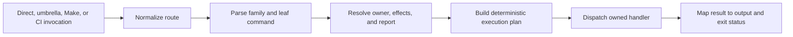

# Command Routing

`bijux-atlas-dev` routes commands through stable domain families such as
`docs`, `ops`, `load`, `security`, `governance`, and `release`. Routing binds a
user-visible invocation to an owner, effect contract, handler, report shape,
and exit semantics.

## Routing Model

```mermaid
flowchart LR
    Invocation[Direct, umbrella, Make, or CI invocation] --> Normalize[Normalize route]
    Normalize --> Parse[Parse family and leaf command]
    Parse --> Registry[Resolve owner, effects, and report]
    Registry --> Plan[Build deterministic execution plan]
    Plan --> Dispatch[Dispatch owned handler]
    Dispatch --> Result[Map result to output and exit status]
```

## Route Identity

The same logical action may be reached through the direct binary, `bijux dev
atlas`, a curated `make` target, or CI. A route identity records enough context
to compare those entrypoints:

- visible invocation and normalized `bijux-atlas-dev` arguments;
- repository root and selected profile, scenario, suite, or report;
- command owner and registered effects;
- implementation and umbrella version identities;
- output format, report identity, and exit status.

Route aliases may improve ergonomics, but they must not change defaults,
silently add capabilities, redirect artifacts, or reinterpret failures. If two
routes disagree, route parity has failed; neither result may be selected merely
because it is convenient.

## Routing Invariants

| Invariant | Required outcome |
| --- | --- |
| one owner | every leaf command resolves to one durable domain owner |
| one meaning | aliases and wrappers preserve arguments, effects, reports, and exit semantics |
| fail closed | unknown, ambiguous, or capability-incomplete routes do not dispatch |
| discoverability | registered commands appear in help, catalogs, and generated references |
| explicit effects | filesystem writes, subprocesses, network calls, and cluster mutation are visible before execution |
| deterministic output | machine output does not depend on terminal formatting or invocation wrapper |

## Choosing a Command Family

Place a command with the contract it evaluates or the action it owns. A docs
link check belongs to `docs`; Kubernetes rendering belongs to `ops`; a baseline
comparison belongs to `load`; release packet verification belongs to
`release`. Cross-domain suites may coordinate these commands, but they should
call the existing owners rather than duplicate their policy.

Top-level families are durable navigation. Adding one requires stronger
justification than adding a leaf command because it changes help, registries,
wrapper parity, generated references, and maintainer expectations.

## Repository Anchors

- CLI families and parser ownership:
  [`interfaces/cli/mod.rs`](../../../crates/bijux-atlas-dev/src/interfaces/cli/mod.rs)
- governed family catalog:
  [`cli-dev-command-surface.json`](../../../configs/sources/governance/governance/cli-dev-command-surface.json)
- public discovery model: [Automation Command Surface](automation-command-surface.md)
- report identities and schemas: [Automation Reports Reference](automation-reports-reference.md)
