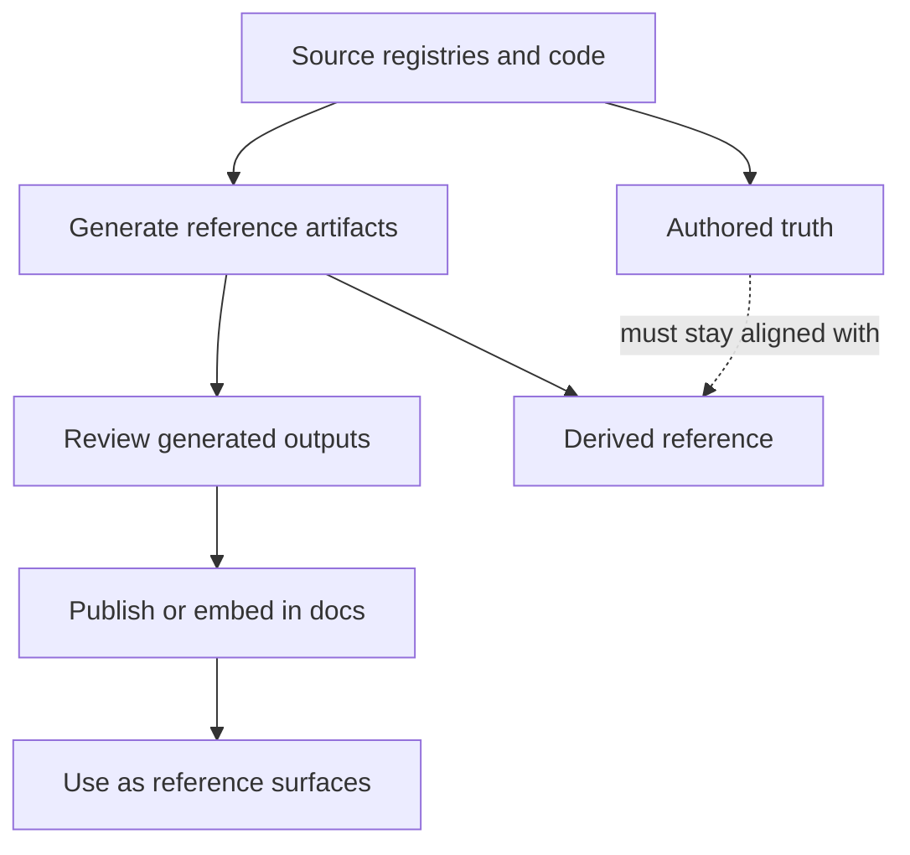

# Generated Reference Workflows

Reference pages should be refreshed with the owning generator rather than hand
edited after the fact.

## Generated Reference Model

This page exists so generated reference content stays visibly downstream of authored truth. When a
maintainer edits generated reference output by hand, the repository loses the ability to explain how
that page was produced.

## Source Anchors

- [`configs/sources/repository/docs/generated-files-registry.json`](/Users/bijan/bijux/bijux-atlas/configs/sources/repository/docs/generated-files-registry.json:1)
- [`docs/bijux-atlas-dev/workspace/generated-files.md`](/Users/bijan/bijux/bijux-atlas/docs/bijux-atlas-dev/workspace/generated-files.md:1)

## Main Takeaway

Generated reference workflows keep Atlas reference docs aligned with the repository's authored
registries and command surfaces. The right fix for drift is to update the source or the generator,
then regenerate and review the derived output.
