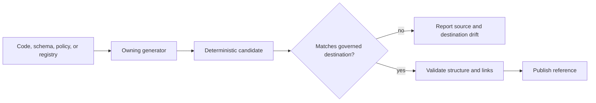

# Generated Reference Workflows

Generated references expose resolved commands, configuration, schemas, and
inventories without making copied prose a second source of truth. Each output
has a declared source, generator, destination, freshness rule, and validation
path.

## Generated Reference Model

```mermaid
flowchart LR
    Authority[Code, schema, policy, or registry] --> Generator[Owning generator]
    Generator --> Candidate[Deterministic candidate]
    Candidate --> Compare{Matches governed destination?}
    Compare -->|no| Drift[Report source and destination drift]
    Compare -->|yes| Validate[Validate structure and links]
    Validate --> Publish[Publish reference]
```

## Ownership Record

A generated file is trustworthy only when its registry entry can answer:

| Field | Question answered |
| --- | --- |
| authority | Which code, schema, policy, or registry defines the facts? |
| generator | Which command and implementation derive the output? |
| destination | Which tracked or publish-time path owns the derived artifact? |
| mode | Is the output tracked, embedded, or produced only for publication? |
| freshness check | How does validation distinguish current output from drift? |
| review surface | Which semantic changes must a reviewer inspect after regeneration? |

The destination is derived state. Hand-editing it may make one checkout look
correct, but the next regeneration will overwrite the change or reveal that no
authority supports it.

## Regeneration Workflow

1. Change the owning source or generator.
2. Run the narrow generator from an explicit repository root.
3. Inspect the semantic diff, including removed entries and ordering changes.
4. Run freshness, metadata, navigation, and link validation for the affected
   reference.
5. Commit source and derived output together when the destination is governed
   as tracked content.

If the generator is non-deterministic, emits machine-local paths, depends on
ambient time without a governed timestamp, or produces different output
through direct and wrapper routes, generation is not complete. Preserve the
failure rather than normalizing the diff by hand.

## Evidence Limits

A fresh generated command catalog proves that the catalog matches its current
authority. It does not prove that every command executed successfully. A fresh
configuration reference proves resolved schema or default information; it does
not prove that a deployment using those values became ready. Execution claims
still require evidence from the owning workflow.

## Source Anchors

- generated-file registry:
  [`generated-files-registry.json`](https://github.com/bijux/bijux-atlas/blob/main/configs/sources/repository/docs/generated-files-registry.json)
- generated-file ownership and modes: [Generated Files](../workspace/generated-files.md)
- generated command catalog: [Automation Command Surface](automation-command-surface.md)
