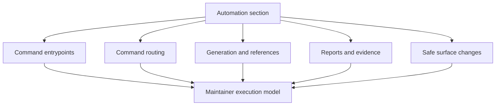

# Automation

`bijux-atlas-dev/automation` is the section home for this handbook slice.

Automation here means the governed execution surface of the repository. That
includes `bijux dev atlas`, the direct `bijux-dev-atlas` binary, thin `make`
wrappers, and the report or evidence families those entrypoints produce.

## Control Model

- `bijux dev atlas` is the canonical human-facing control-plane surface
- `bijux-dev-atlas` is the direct binary surface beneath it
- `make` remains a thin convenience wrapper, not the ultimate authority
- configs, registries, and generated outputs determine whether the automation is
  behaving correctly

## Page Roles

- concept and control pages: command routing, automation control plane
- extension workflow pages: adding CLI, HTTP, or contract surfaces
- evidence and execution reference pages: reports, generated references,
  subprocess policy, tutorial runs

## Pages

- [Adding CLI Surface](adding-cli-surface.md)
- [Adding Contracts](adding-contracts.md)
- [Adding HTTP Surface](adding-http-surface.md)
- [Automation Command Surface](automation-command-surface.md)
- [Automation Control Plane](automation-control-plane.md)
- [Automation Reports Reference](automation-reports-reference.md)
- [Command Routing](command-routing.md)
- [Generated Reference Workflows](generated-reference-workflows.md)
- [Subprocess Allowance](subprocess-allowance.md)
- [Tutorial Runs](tutorial-runs.md)
