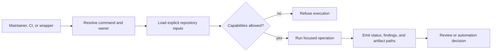

# Automation

Atlas automation is a typed repository control plane. It resolves command
ownership, validates explicit inputs, declares required capabilities, and emits
structured reports. Shell and Make entrypoints remain adapters around that
model rather than independent sources of repository behavior.

```mermaid
flowchart LR
    Caller[Maintainer, CI, or wrapper] --> Command[Resolve command and owner]
    Command --> Inputs[Load explicit repository inputs]
    Inputs --> Capabilities{Capabilities allowed?}
    Capabilities -->|no| Deny[Refuse execution]
    Capabilities -->|yes| Execute[Run focused operation]
    Execute --> Report[Emit status, findings, and artifact paths]
    Report --> Decision[Review or automation decision]
```

## Entry Points

| Surface | Role | Stability boundary |
| --- | --- | --- |
| `bijux dev atlas ...` | installed maintainer route in a Bijux environment | delegated command route |
| `bijux-atlas-dev ...` | direct control-plane binary | authoritative repository command implementation |
| `cargo run -p bijux-atlas-dev -- ...` | checkout execution of the direct binary | source-tree command behavior |
| `make ...` | curated convenience aliases | wrapper only; must not own hidden orchestration |

Command discovery, Clap exposure, registries, and report registries are related
but distinct inventories. A command listed in one is not automatically callable
through every entrypoint. Verify the exact route and its `--help` output before
building automation around it.

## Capability Boundary

Read-only commands should require no filesystem writes, network, subprocess,
or cluster access. Commands that need those powers must declare them and fail
when they are unavailable. Capability denial is a controlled outcome, not a
reason to bypass the control plane with an untracked shell command.

| Capability | Typical use | Review concern |
| --- | --- | --- |
| filesystem write | generation and governed artifact creation | destination ownership and overwrite behavior |
| subprocess | external validators and build tools | executable identity, arguments, and captured result |
| network | remote verification or publication | endpoint, credentials, retry, and partial failure |
| cluster | render-independent conformance or operations | profile, context, namespace, and mutation scope |

## Route by Intent

- [Automation Command Surface](automation-command-surface.md) inventories the
  exposed command model.
- [Command Routing](command-routing.md) traces umbrella, direct binary, and
  wrapper delegation.
- [Automation Control Plane](automation-control-plane.md) defines execution and
  capability boundaries.
- [Automation Reports Reference](automation-reports-reference.md) defines
  report families and validation depth.
- [Generated Reference Workflows](generated-reference-workflows.md) governs
  derived references and drift.
- [Subprocess Allowance](subprocess-allowance.md) records external-tool policy.
- [Tutorial Runs](tutorial-runs.md) separates teaching runs from release proof.
- [Adding CLI Surface](adding-cli-surface.md), [Adding HTTP Surface](adding-http-surface.md),
  and [Adding Contracts](adding-contracts.md) preserve ownership when the public
  surface expands.

## Completion Contract

A successful command exit is insufficient when required evidence is absent.
Completion requires the report status, findings, input identity, output paths,
and declared capabilities to agree. An empty report, skipped external check, or
missing governed output remains visible as incomplete or failed evidence.
