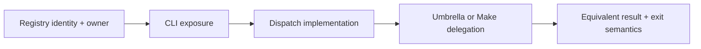
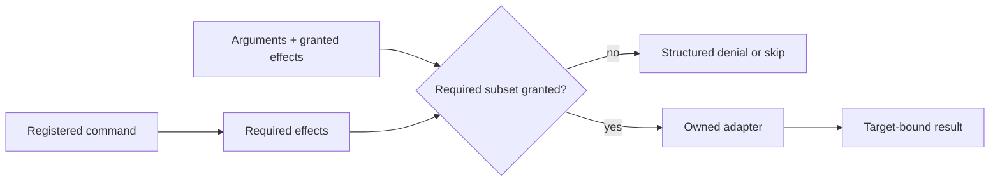

# Automation

Atlas automation resolves command ownership, loads explicit inputs, gates
effects, and emits structured results. Shell, Make, and umbrella entrypoints are
adapters around that control plane; they are not independent sources of
repository behavior.

## Route parity

```mermaid
flowchart LR
    Registry[Registry identity + owner] --> Parser[CLI exposure]
    Parser --> Dispatch[Dispatch implementation]
    Dispatch --> Wrapper[Umbrella or Make delegation]
    Wrapper --> Result[Equivalent result + exit semantics]
```

| Surface | Role | Contract boundary |
| --- | --- | --- |
| `bijux dev atlas ...` | Installed maintainer route | Delegates without changing arguments or meaning |
| `bijux-atlas-dev ...` | Direct control-plane binary | Authoritative command implementation |
| `cargo run --locked -p bijux-atlas-dev -- ...` | Checkout execution | Behavior of the current source tree |
| `make ...` | Curated convenience aliases | Wrapper only; no hidden orchestration |

Registry membership establishes ownership and intent. It does not prove parser
exposure, dispatch, or wrapper parity. Compare argument forwarding, default
format, exit status, capability requirements, and report identity through every
supported route.

## Effect boundary

```mermaid
flowchart LR
    Contract[Registered command] --> Required[Required effects]
    Run[Arguments + granted effects] --> Gate{Required subset granted?}
    Required --> Gate
    Gate -->|no| Denied[Structured denial or skip]
    Gate -->|yes| Execute[Owned adapter]
    Execute --> Receipt[Target-bound result]
```

| Effect | Record with the result |
| --- | --- |
| filesystem write | Owned paths, previous and resulting identity, and generated status |
| subprocess | Executable identity, arguments, exit status, and captured output |
| Git | Repository, revision, worktree state, and exact operation |
| network | Endpoint, trust policy, retrieved identity, time, and partial-failure state |
| cluster | Profile, context, namespace, requested mutation, and admitted identity |

Capability presence proves permission, not successful execution. Denials,
missing tools, skipped external checks, and incomplete outputs remain explicit.

## Report validation depth

The generic `reports validate` route walks JSON reports and checks that each
`report_id` exists in the registry and its numeric `version` matches. It does
not validate payloads against referenced JSON Schemas, inspect internal status,
or prove that referenced artifacts exist.

| Layer | Establishes |
| --- | --- |
| registry validation | Report identity and version membership |
| schema validation | Payload fields and types match the report contract |
| semantic validation | Status, findings, counts, and invariants agree |
| artifact verification | Referenced outputs exist and match recorded hashes |
| candidate binding | Inputs and outputs belong to the release under review |

Use every applicable layer before treating a report as decision-bearing. A
generic registry pass is catalog hygiene, not full report conformance.

## Route by intent

| Need | Continue to |
| --- | --- |
| Discover the exposed command model | [Automation Command Surface](automation-command-surface.md) |
| Trace direct and delegated dispatch | [Command Routing](command-routing.md) |
| Understand execution and effects | [Automation Control Plane](automation-control-plane.md) |
| Inspect report families | [Automation Reports Reference](automation-reports-reference.md) |
| Regenerate governed references | [Generated Reference Workflows](generated-reference-workflows.md) |
| Review external-tool policy | [Subprocess Allowance](subprocess-allowance.md) |
| Separate teaching runs from release proof | [Tutorial Runs](tutorial-runs.md) |
| Add a public command | [Adding CLI Surface](adding-cli-surface.md) |
| Add a public HTTP route | [Adding HTTP Surface](adding-http-surface.md) |
| Add a governed contract | [Adding Contracts](adding-contracts.md) |
