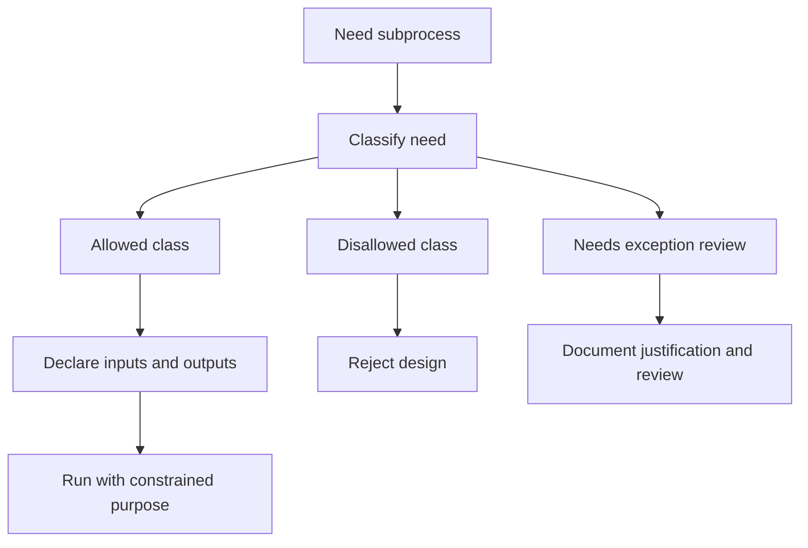

# Subprocess Allowance

Subprocess execution is governed and should stay visible in maintainer command
surfaces when external tools such as `mkdocs`, `helm`, or `kubectl` are needed.

## Subprocess Decision Model

Atlas uses explicit `--allow-subprocess` flags because subprocess work is a real capability boundary,
not an implementation detail that should disappear inside a command.

## Repository Anchors

- [`crates/bijux-dev-atlas/src/interfaces/cli/mod.rs`](/Users/bijan/bijux/bijux-atlas/crates/bijux-dev-atlas/src/interfaces/cli/mod.rs:1) defines command surfaces that may request subprocess capability
- [`crates/bijux-dev-atlas/src/core/registry.rs`](/Users/bijan/bijux/bijux-atlas/crates/bijux-dev-atlas/src/core/registry.rs:144) enforces declared `effects_required`
- [`crates/bijux-dev-atlas/src/engine/runner.rs`](/Users/bijan/bijux/bijux-atlas/crates/bijux-dev-atlas/src/engine/runner.rs:96) fails closed when subprocess capability was not granted

## Main Takeaway

Subprocess allowance keeps Atlas honest about side effects. If a command needs external tools, the
need should be declared, reviewable, and easy for another maintainer to see from the invocation
itself.
