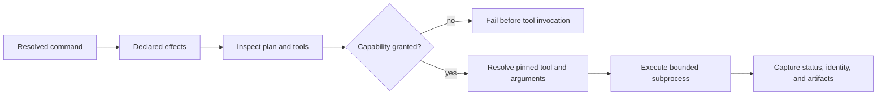

# Subprocess Allowance

Subprocess execution is an explicit control-plane capability. Commands may
inspect repository state without it; invoking tools such as `mkdocs`, `helm`,
`kubectl`, container engines, or load generators requires the caller to grant
the capability deliberately.

## Subprocess Decision Model

```mermaid
flowchart LR
    Command[Resolved command] --> Effects[Declared effects]
    Effects --> Plan[Inspect plan and tools]
    Plan --> Grant{Capability granted?}
    Grant -->|no| Reject[Fail before tool invocation]
    Grant -->|yes| Resolve[Resolve pinned tool and arguments]
    Resolve --> Run[Execute bounded subprocess]
    Run --> Capture[Capture status, identity, and artifacts]
```

The grant authorizes the named invocation path; it is not a general statement
that every external effect is safe. Network access, filesystem writes, cluster
mutation, credentials, and destructive operations remain separate concerns
and require their own command contract and safeguards.

## Capability Contract

| Concern | Required behavior |
| --- | --- |
| discovery | command metadata declares subprocess effects before execution |
| planning | the selected tool, arguments, inputs, outputs, and target are inspectable |
| authorization | effect mode without `--allow-subprocess` fails closed |
| tool identity | resolution records the executable and governed version or pin where applicable |
| target identity | cluster context, repository root, profile, or destination is resolved before mutation |
| output | exit status, standard streams, report identity, and artifact paths remain attributable |
| failure | missing tools and non-zero exits remain errors unless the contract explicitly defines another result |

Static mode may report that an effect-only case was not run. Such a result is
an inspection outcome, not proof that the external workflow passed. Required
effect checks must not convert a missing capability or tool into success.

## Safe Invocation Sequence

1. Select the narrow command, profile, scenario, or report.
2. Inspect its help, registry metadata, and plan output.
3. Resolve the repository root and any external target explicitly.
4. Grant only the capability required for the planned subprocess.
5. Retain structured status and generated evidence under the repository
   artifact root.
6. Verify that the report describes the same command route, inputs, tool, and
   target that were approved.

Wrappers do not weaken this sequence. A `make` target, umbrella command, or CI
job must preserve the same effect declaration and fail-closed behavior as the
direct `bijux-atlas-dev` route.

## Repository Anchors

- command surface and global capability flags:
  [`interfaces/cli/mod.rs`](https://github.com/bijux/bijux-atlas/blob/main/crates/bijux-atlas-dev/src/interfaces/cli/mod.rs)
- registered effect declarations:
  [`core/registry.rs`](https://github.com/bijux/bijux-atlas/blob/main/crates/bijux-atlas-dev/src/core/registry.rs)
- effect-mode enforcement and result capture:
  [`engine/runner.rs`](https://github.com/bijux/bijux-atlas/blob/main/crates/bijux-atlas-dev/src/engine/runner.rs)

[Automation Control Plane](automation-control-plane.md) defines the wider
inspection, planning, execution, and reporting boundary.
