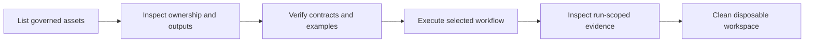
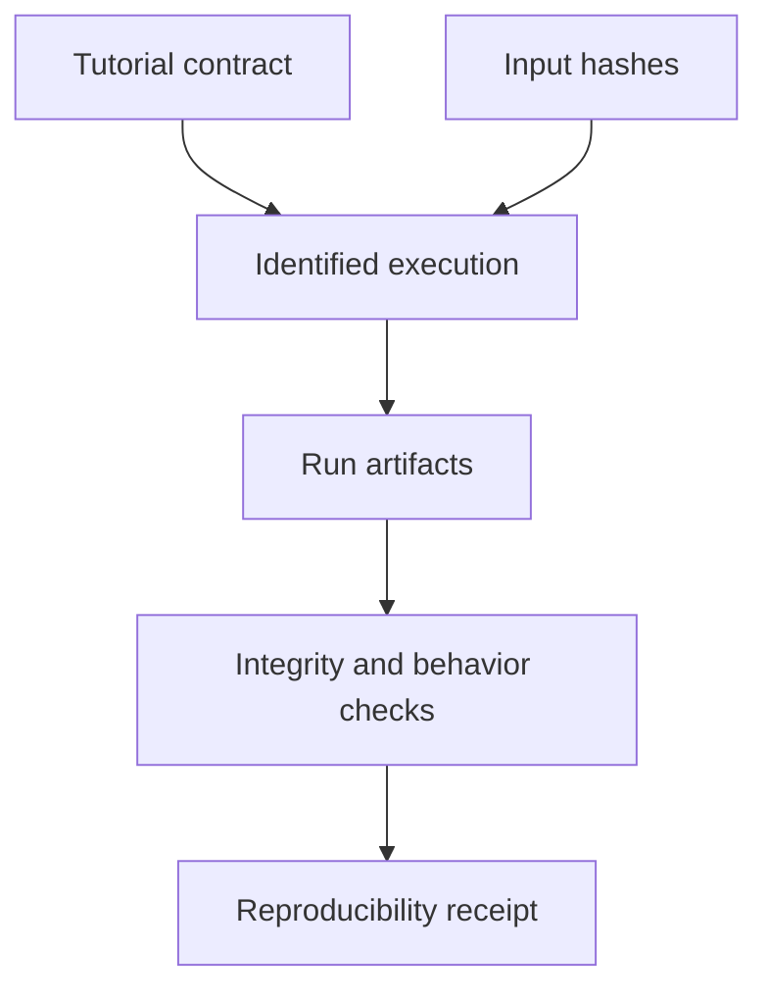

# Tutorial Runs

Atlas tutorials are executable learning paths with bounded evidence. They teach
dataset, query, dashboard, and real-data workflows while keeping tutorial
artifacts separate from release qualification.

## Tutorial Surfaces

| Surface | Authority | Role |
| --- | --- | --- |
| dataset contract | `ops/tutorials/contracts/tutorial-dataset-contract.json` | fixes tutorial identity and expected dataset behavior |
| evidence examples | `ops/tutorials/evidence/` | demonstrate report shape and evidence relationships |
| dashboard examples | `ops/tutorials/dashboards/` | provide tutorial-specific diagnostic views |
| command implementation | `crates/bijux-atlas-dev/src/application/tutorials.rs` | lists, verifies, runs, packages, and cleans tutorial workflows |
| run output | `artifacts/tutorials/` | keeps disposable execution evidence outside governed sources |

Checked-in evidence and dashboards are examples until an identified tutorial
run produces fresh results. Their presence does not prove a dataset was
ingested, a query was correct, or a dashboard observed a live runtime.

## Command Route



Begin with discovery and static verification:

```bash
cargo run --locked -p bijux-atlas-dev -- tutorials list --format json
cargo run --locked -p bijux-atlas-dev -- tutorials verify --format json
```

Use `tutorials --help` and the relevant nested command help before a workflow
that fetches data, writes artifacts, or invokes external tools. Real-data
commands have materially different cost and network behavior from static
contract verification.

## Reproducibility Receipt

Every executed tutorial should retain:

- source revision and tutorial contract hash;
- command route, arguments, tool versions, and granted effects;
- input dataset identity and checksums;
- generated dataset, query-pack, dashboard, and evidence identities;
- internal status and findings; and
- cleanup result for disposable state.



An idempotency result is valid only when the repeated run uses the same
contract, inputs, tools, and effect boundary. Equal file names or a successful
second command do not establish equal outputs.

## Teaching Evidence Versus Release Evidence

| Tutorial result | Safe conclusion | Unsafe conclusion |
| --- | --- | --- |
| static verification passes | governed tutorial assets and implemented checks agree | runtime workflow executed |
| dataset workflow passes | selected inputs completed the tutorial path | production-scale ingest is qualified |
| query pack passes | documented queries behaved for the tutorial dataset | all API, dataset, or concurrency behavior is compatible |
| dashboard validation passes | tutorial dashboard JSON satisfies implemented checks | telemetry was emitted, scraped, and retained |
| reproducibility check passes | named runs matched under recorded conditions | release artifacts are independently reproducible |

Tutorial failures are product or documentation findings when the documented
path is supported. Do not weaken expected output merely to preserve a passing
example; correct the owning behavior or update the public contract with an
explicit compatibility decision.

Use [Automation Reports Reference](automation-reports-reference.md) to
interpret structured output and [Artifact Roots](../workspace/artifact-roots.md)
for run-product custody.
