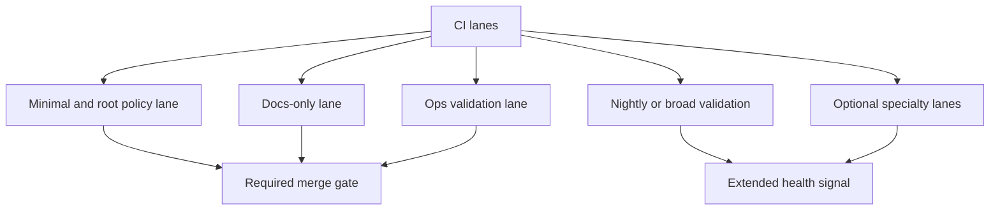

# CI Lanes and Status Checks

Atlas CI is composed of named workflow lanes and required checks rather than a
single monolithic pipeline.

## CI Lane Model

This page exists because CI becomes much easier to reason about once maintainers see it as a set of
named lanes with different jobs, not as one undifferentiated wall of checks.

## Source Anchors

- [`.github/workflows/ci.yml`](/Users/bijan/bijux/bijux-atlas/.github/workflows/ci.yml:1)
- [`.github/workflows/docs-only.yml`](/Users/bijan/bijux/bijux-atlas/.github/workflows/docs-only.yml:1)
- [`.github/workflows/ops-validate.yml`](/Users/bijan/bijux/bijux-atlas/.github/workflows/ops-validate.yml:1)
- [`.github/required-status-checks.md`](/Users/bijan/bijux/bijux-atlas/.github/required-status-checks.md:1)

## What The Main Lanes Mean

- `ci-pr` is the general pull-request gate and includes the required root policy, validation, supply-chain, and workflow-policy checks
- `docs-only` is the docs-focused gate that validates markdown quality, generated references, mkdocs contract, and strict site build
- `ops-validate` is the operational gate that renders, validates, and inventories ops-facing changes
- nightly and specialty workflows extend coverage without pretending to be the required merge contract

## Status Check Reading Rule

Read a failed status check by lane purpose first:

- if it is a required merge gate, treat it as release-blocking for that PR
- if it is a docs or ops lane, review the produced artifact bundle and report paths, not only the job name
- if it is a nightly or specialty lane, decide whether it reveals a real regression or an advisory signal that needs follow-up work

## Main Takeaway

Atlas CI is intentional gate design, not a single pipeline. Maintainers should understand which lane
is proving merge readiness, which one is producing domain-specific evidence, and which ones extend
health coverage beyond the merge contract.
