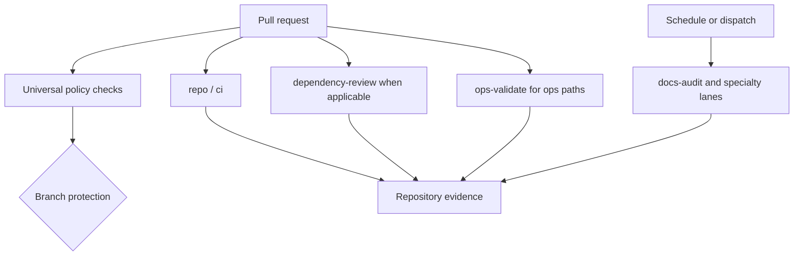
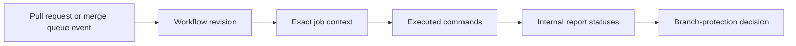

# CI Lanes and Status Checks

Atlas separates universal merge policy from repository-specific and
path-scoped validation. A green specialty workflow is useful evidence, but it
is not automatically a branch-protection requirement.

```mermaid
flowchart TD
    PR[Pull request] --> Policy[Universal policy checks]
    PR --> Repo[repo / ci]
    PR --> Review[dependency-review when applicable]
    PR --> Ops[ops-validate for ops paths]
    Manual[Schedule or dispatch] --> Audit[docs-audit and specialty lanes]
    Policy --> Merge{Branch protection}
    Repo --> Evidence[Repository evidence]
    Review --> Evidence
    Ops --> Evidence
    Audit --> Evidence
```

## Branch-Protection Contract

`.github/required-status-checks.md` and
`.github/rulesets/main-branch-protection.json` currently agree on four required
contexts:

- `policy / github`
- `policy / pr approval`
- `std / standard`
- `std / report`

Those contexts are the universal merge baseline. Repository workflows can
still fail a pull request or supply required review evidence, but they are not
part of the checked-in branch-protection list unless their exact context is
added to both authorities.

## Repository Lanes

| Lane | Trigger | Claim and evidence boundary |
| --- | --- | --- |
| `repo / ci` | pull requests and merge queue for `main` | delegates formatting, lint, security, and test commands to the reusable Rust stack; it is not named in the checked-in required-context list |
| `dependency-review` | pull requests | evaluates dependency graph changes with the GitHub dependency review action |
| `ops-validate` | pull requests changing governed ops paths | runs ops validation, doctor, render, schema, and inventory commands and uploads the run artifact tree |
| `docs-audit` | weekly schedule or manual dispatch | runs Markdown lint, external-link checks, generated-reference checks, a strict preview build, and documentation validation |
| `deploy-docs` | reusable call or manual dispatch | resolves repository-specific docs commands, builds the site, verifies it when configured, and publishes only on an eligible ref |

There is no `.github/workflows/docs-only.yml` in the repository. Documentation
confidence comes from the scheduled/manual `docs-audit`, the reusable
`deploy-docs` workflow, and any documentation checks reached through other CI
entrypoints. Do not report a nonexistent `docs-only` context as merge proof.

## Interpret a Result

Start with the exact workflow and job context shown by GitHub, then inspect the
workflow trigger and retained artifacts. A path-scoped lane proves only the
paths and commands it selected. A scheduled audit can reveal repository drift,
but a later green run does not retroactively prove that a pull request passed
that audit. Branch protection answers whether merging is permitted; domain
reports answer what was actually exercised.

## Context Identity

A required check is identified by more than a workflow filename. Preserve the
event, workflow revision, job context, source revision, attempt, and conclusion.

```mermaid
flowchart LR
    Event[Pull request or merge queue event] --> Workflow[Workflow revision]
    Workflow --> Job[Exact job context]
    Job --> Commands[Executed commands]
    Commands --> Reports[Internal report statuses]
    Reports --> Protection[Branch-protection decision]
```

Renaming a job can orphan the required context even when the underlying command
still runs. Adding a path filter can make a required context absent for changes
outside that filter. Review workflow and ruleset changes together whenever a
context name, trigger, or event changes.

## Selection, Execution, and Requirement

| Layer | Question | Failure to avoid |
| --- | --- | --- |
| selection | did the event and changed paths select the workflow? | treating an absent run as a pass |
| execution | did every intended command and test actually run? | accepting zero-test filters or tolerated failures |
| internal result | do emitted reports pass their own contracts? | relying only on the outer job conclusion |
| retention | can a reviewer recover inputs, logs, and run-scoped outputs? | accepting uploaded file presence without content review |
| requirement | did the exact context satisfy current branch protection? | assuming a specialty lane is a merge gate |

The same run can be strong domain evidence without being required by branch
protection, or satisfy branch protection while remaining too narrow for a
release claim. Keep merge authorization and technical evidence separate.

## Change Review

For every CI workflow change:

1. compare path and event coverage with the contracts executed inside the job;
2. verify test selectors match at least one intended test and preserve the
   observed count;
3. reject `|| true` on required evidence producers unless a downstream
   fail-closed validator demonstrably consumes the failure;
4. retain diagnostics with `if: always()` without interpreting upload as pass;
5. parse the workflow and run the narrow commands changed by the patch; and
6. reconcile exact job contexts with checked-in and live branch protection.

Scheduled and manual runs are useful for drift discovery. They do not replace
pull-request evidence for the candidate revision unless the run is explicitly
bound to that revision and accepted by policy.
