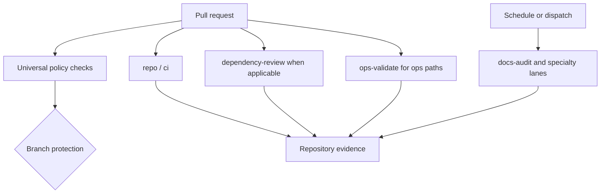

# CI Lanes and Status Checks

Atlas separates universal merge policy from repository-specific and
path-scoped validation. A green specialty workflow is useful evidence, but it
is not automatically a branch-protection requirement.

```mermaid
flowchart TD
    PR[Pull request] --> Policy[Universal policy checks]
    PR --> Repo[repo / ci]
    PR --> Review[dependency-review when applicable]
    PR --> Ops[ops-validate for ops paths]
    Manual[Schedule or dispatch] --> Audit[docs-audit and specialty lanes]
    Policy --> Merge{Branch protection}
    Repo --> Evidence[Repository evidence]
    Review --> Evidence
    Ops --> Evidence
    Audit --> Evidence
```

## Branch-Protection Contract

`.github/required-status-checks.md` and
`.github/rulesets/main-branch-protection.json` currently agree on four required
contexts:

- `policy / github`
- `policy / pr approval`
- `std / standard`
- `std / report`

Those contexts are the universal merge baseline. Repository workflows can
still fail a pull request or supply required review evidence, but they are not
part of the checked-in branch-protection list unless their exact context is
added to both authorities.

## Repository Lanes

| Lane | Trigger | Claim and evidence boundary |
| --- | --- | --- |
| `repo / ci` | pull requests and merge queue for `main` | delegates formatting, lint, security, and test commands to the reusable Rust stack; it is not named in the checked-in required-context list |
| `dependency-review` | pull requests | evaluates dependency graph changes with the GitHub dependency review action |
| `ops-validate` | pull requests changing governed ops paths | runs ops validation, doctor, render, schema, and inventory commands and uploads the run artifact tree |
| `docs-audit` | weekly schedule or manual dispatch | runs Markdown lint, external-link checks, generated-reference checks, a strict preview build, and documentation validation |
| `deploy-docs` | reusable call or manual dispatch | resolves repository-specific docs commands, builds the site, verifies it when configured, and publishes only on an eligible ref |

There is no `.github/workflows/docs-only.yml` in the repository. Documentation
confidence comes from the scheduled/manual `docs-audit`, the reusable
`deploy-docs` workflow, and any documentation checks reached through other CI
entrypoints. Do not report a nonexistent `docs-only` context as merge proof.

## Interpret a Result

Start with the exact workflow and job context shown by GitHub, then inspect the
workflow trigger and retained artifacts. A path-scoped lane proves only the
paths and commands it selected. A scheduled audit can reveal repository drift,
but a later green run does not retroactively prove that a pull request passed
that audit. Branch protection answers whether merging is permitted; domain
reports answer what was actually exercised.
