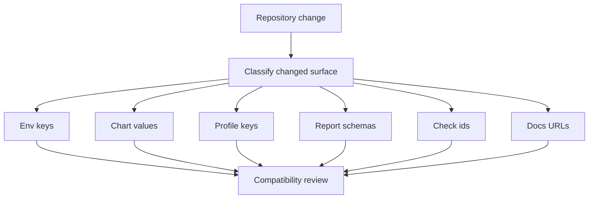

# Compatibility Matrix

Compatibility matrix generation makes release compatibility visible across
surfaces instead of leaving it to scattered notes.

## Compatibility Matrix Model

This page matters because compatibility is not one yes-or-no property in Atlas. Different surfaces
carry different break conditions, overlap windows, and rename obligations.

## Source Anchor

- [`configs/sources/governance/governance/compatibility.yaml`](/Users/bijan/bijux/bijux-atlas/configs/sources/governance/governance/compatibility.yaml:1)

## What The Matrix Governs

The current compatibility rules cover:

- `env_keys`
- `chart_values`
- `profile_keys`
- `report_schemas`
- `check_ids`
- `docs_urls`

For each surface, the registry defines breaking-change examples and rename requirements. It also
sets deprecation windows, such as 180 days for most machine-consumed surfaces and 365 days for docs
URLs.

## Main Takeaway

The compatibility matrix gives maintainers a surface-by-surface way to judge release impact. It
turns compatibility review from intuition into a governed checklist of break conditions, overlap
windows, and required follow-up work.
