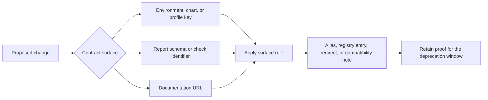
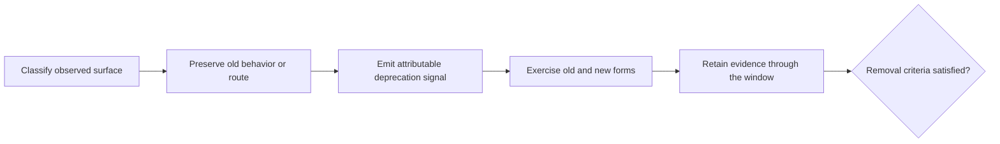

# Compatibility Matrix

Atlas treats compatibility as a set of independently versioned contracts. An
environment variable can remain compatible while a report schema breaks; a
documentation move can be safe only when its former URL redirects. The
compatibility registry makes those distinctions reviewable.

```mermaid
flowchart LR
    Change[Proposed change] --> Classify{Contract surface}
    Classify --> Runtime[Environment, chart, or profile key]
    Classify --> Evidence[Report schema or check identifier]
    Classify --> Reader[Documentation URL]
    Runtime --> Rule[Apply surface rule]
    Evidence --> Rule
    Reader --> Rule
    Rule --> Proof[Alias, registry entry, redirect, or compatibility note]
    Proof --> Window[Retain proof for the deprecation window]
```

The authority is
`configs/sources/governance/governance/compatibility.yaml`. It defines what is
breaking, what a rename must preserve, and how long an overlap remains in
force. It does not infer compatibility from version numbers or release notes.

## Governed Surfaces

| Surface | Breaking examples | Required rename evidence | Window |
| --- | --- | --- | --- |
| environment keys | removal, requiredness change, rename without overlap | allowlist coverage, registry entry, documentation | 180 days |
| chart values | removal, type change, safety-default change | old and new keys accepted, warning for the old key | 180 days |
| profile keys | removal of a consumed key or premature alias removal | registry entry and warning-report coverage | 180 days |
| report schemas | required-field removal, type change, identity change without notice | registry entry and compatibility note | 180 days |
| check identifiers | removal without replacement or archival record | registry entry and overlapping runnable identifiers | 180 days |
| documentation URLs | move without redirect or reuse with different meaning | redirect entry and documentation update | 365 days |

## Review a Change

1. Classify every externally observed surface changed by the patch.
2. Compare the change with the breaking examples for that surface.
3. Add the required alias, warning, registry entry, compatibility note, or
   redirect before removing the old behavior.
4. Record the removal target and keep both forms usable for the declared
   window.
5. Validate the generated or runtime evidence that proves the overlap exists.

A change that touches several rows carries several obligations. Preserving an
old environment key, for example, does not compensate for renaming a check
identifier without an overlap. The matrix is a classification and retention
contract; the owning implementation and its validation evidence prove that the
contract was actually honored.

## Compatibility Evidence Ladder

```mermaid
flowchart LR
    Classify[Classify observed surface] --> Preserve[Preserve old behavior or route]
    Preserve --> Warn[Emit attributable deprecation signal]
    Warn --> Exercise[Exercise old and new forms]
    Exercise --> Retain[Retain evidence through the window]
    Retain --> Remove{Removal criteria satisfied?}
```

| Evidence level | Required proof |
| --- | --- |
| declaration | registry entry identifies old, new, owner, and removal date |
| resolution | both identities resolve to the intended owner during overlap |
| behavior | old and new forms produce compatible results for representative cases |
| warning | deprecated use emits a stable, attributable signal without corrupting machine output |
| removal | window elapsed, usage was reviewed, references migrated, and breaking-change authority approved deletion |

Do not start the compatibility window when code is merged if users cannot yet
observe the replacement. Start from the released version that exposes both
forms and retain that release identity with the record.

## Cross-Surface Changes

A single feature often spans several rows. Renaming a chart value can also
change an environment variable, rendered ConfigMap key, report field, alert
label, example command, and documentation URL. Build a compatibility ledger
before implementation:

| Observed edge | Compatibility question |
| --- | --- |
| input to configuration | are old and new keys accepted with defined precedence? |
| configuration to runtime | does either form produce the same canonical internal value? |
| runtime to evidence | do reports preserve stable field identity or publish a schema transition? |
| evidence to automation | can existing consumers distinguish warning from failure? |
| documentation to public URL | do old links reach the canonical replacement? |

Precedence must be explicit when both old and new inputs are supplied. Silent
last-writer behavior makes migration nondeterministic; reject the conflict or
document one canonical winner and test it.

## Removal Gate

Remove a compatibility path only when its owning record identifies the release
that introduced the replacement, the final supported release, observed usage
or migration evidence, and the approving authority. Run the old-form negative
test after removal so accidental continued acceptance does not create an
undocumented interface.

A redirect, alias, or warning that exists only in documentation is not runtime
compatibility. Conversely, runtime overlap without public migration guidance
leaves consumers unable to use the compatibility window safely.
