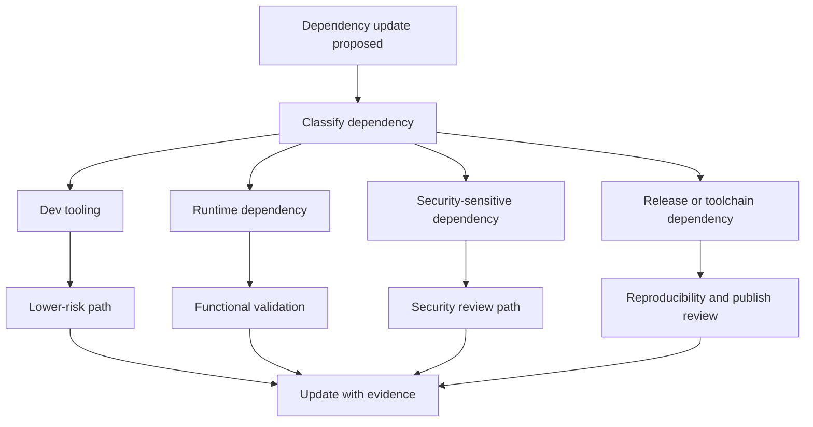

# Dependency Updates

Dependency lock, review, and update paths are governed through explicit
workflow lanes and repository checks.

## Dependency Update Model

This page matters because Atlas should not treat every dependency update as the
same kind of change. A lockfile refresh, a runtime dependency jump, and a
release/toolchain change each have different risk and proof expectations.

## Workflow Anchors

- [`.github/workflows/dependency-review.yml`](/Users/bijan/bijux/bijux-atlas/.github/workflows/dependency-review.yml:1) provides PR-time dependency review
- [`.github/workflows/dependency-lock.yml`](/Users/bijan/bijux/bijux-atlas/.github/workflows/dependency-lock.yml:1) defines the only allowed automated lockfile refresh path
- release-sensitive dependency policy lives in [`configs/sources/release/dependency-policy.json`](/Users/bijan/bijux/bijux-atlas/configs/sources/release/dependency-policy.json:1)

## Main Takeaway

Dependency updates are governed maintenance, not generic churn. Atlas keeps
separate review and evidence paths so maintainers can update dependencies
without blurring low-risk automation, runtime behavior change, and
release-sensitive policy work.
